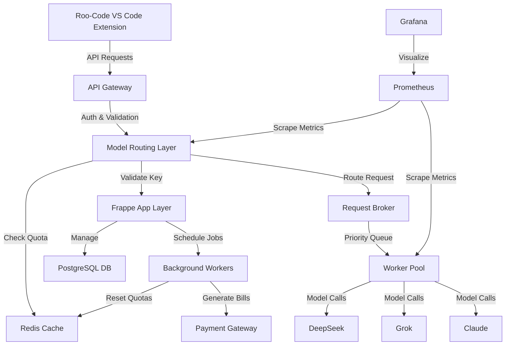

# Oropendola AI - Enterprise Architecture

## System Overview

This document describes the complete architecture for the Oropendola AI system - a scalable, enterprise-grade AI routing platform built on Frappe that manages multiple AI models (DeepSeek, Grok, Claude) with intelligent load balancing, subscription management, and billing.

## Architecture Diagram



## System Components

### 1. Frontend Layer
- **Roo-Code VS Code Extension** (Oropendola AI Fork)
  - Handles all user interactions
  - Manages To-Do framework
  - Sends API requests with API keys
  - No billing/subscription logic

### 2. API Gateway (NGINX/Traefik)
- TLS termination
- API key authentication
- Rate limiting (basic)
- IP whitelisting/blacklisting
- WAF protection

### 3. Frappe App Layer (Control Plane)
- Core DocTypes for business logic
- REST API endpoints
- Admin UI
- Background job scheduler
- Billing orchestration

### 4. Model Routing Layer (Python Microservice)
- Stateless service
- API key validation (with Redis cache)
- Quota/rate limit checks
- Intelligent model selection
- Health-based load balancing
- Cost optimization

### 5. Request Broker (Redis Streams/RabbitMQ)
- Priority-based queuing
- Request buffering
- Backpressure handling
- Dead letter queue

### 6. Worker Pool
- Async workers for model calls
- Timeout handling
- Retry logic with exponential backoff
- Fallback model selection
- Usage logging

### 7. Model Pool
- DeepSeek endpoint
- Grok endpoint  
- Claude endpoint
- Health check endpoints
- Auto-scaling connectors

### 8. Data Layer
- **PostgreSQL**: Primary data store (Frappe)
- **Redis**: Caching, quotas, rate limits, queues
- **S3/MinIO**: Usage logs archive (optional)

### 9. Observability
- **Prometheus**: Metrics collection
- **Grafana**: Dashboards and alerts
- **ELK/Loki**: Centralized logging
- **Alertmanager**: Incident notifications

## Subscription Plans

### Plan A - 1-Day Trial
- **Price**: ₹199
- **Duration**: 1 day
- **Quota**: 200 requests/day
- **Features**: Premium Fast Requests
- **Priority Score**: 10
- **Models**: All (DeepSeek, Grok, Claude)

### Plan B - 15 Days
- **Price**: ₹999
- **Duration**: 15 days
- **Quota**: 600 requests/day
- **Features**: Premium Fast Requests
- **Priority Score**: 20
- **Models**: All (DeepSeek, Grok, Claude)

### Plan C - 1 Month Unlimited
- **Price**: ₹4,999
- **Duration**: 30 days
- **Quota**: Unlimited
- **Features**: 
  - Premium Fast Requests
  - High-Priority Support
  - Smart To-Do List
  - 1M Context Window
- **Priority Score**: 50
- **Models**: All (DeepSeek, Grok, Claude)

## Routing Strategy

### Model Selection Algorithm

The routing layer uses a weighted scoring system:

```python
score = (w1 * (1 / latency_ms)) + 
        (w2 * capacity_score) - 
        (w3 * cost_per_unit) + 
        (w4 * subscription_priority)
```

**Weights** (configurable via environment):
- `w1` (latency): 1.0
- `w2` (capacity): 0.5
- `w3` (cost): 1.5
- `w4` (priority): 2.0

### Routing Flow

1. **Validate API Key** (Redis cache, 60s TTL)
2. **Check Quota** (Redis atomic operation)
3. **Check Rate Limit** (Token bucket in Redis)
4. **Filter Eligible Models** (based on plan)
5. **Score Each Model** (using algorithm above)
6. **Select Top Model** (or queue if capacity exceeded)
7. **Execute with Fallback** (retry on next model if timeout)
8. **Log Usage** (async to Frappe)

## Quota & Rate Limiting

### Daily Quota
- Stored in Redis: `quota:{api_key}:{YYYY-MM-DD}`
- Atomic decrement on each request
- Auto-expires at midnight
- Synced to Frappe every 5 minutes

### Rate Limiting
- Token bucket algorithm
- Stored in Redis: `ratelimit:{api_key}`
- Configurable QPS per plan
- Lua script for atomicity

### Enforcement
- **429 Too Many Requests**: Quota/rate limit exceeded
- **401 Unauthorized**: Invalid API key
- **402 Payment Required**: Subscription expired/failed payment
- **503 Service Unavailable**: All models down

## Billing Flow

### Subscription Creation
1. User selects plan in Roo-Code extension
2. Frontend calls `POST /api/method/oropendola_ai.api.create_subscription`
3. Frappe creates AI Subscription + AI Invoice
4. Redirects to Razorpay payment page
5. On success, webhook confirms payment
6. API key generated and returned to user

### Usage Tracking
1. Every request logged to Redis stream
2. Background worker flushes to AI Usage Log (batch every 30s)
3. Stores: timestamp, customer, model, tokens, status, latency

### Billing Cycle
1. Scheduler runs daily at 00:00 UTC
2. Aggregates usage for previous day
3. For metered plans, calculates overage charges
4. Generates AI Invoice
5. Charges via Razorpay API
6. Sends email receipt
7. On failure, marks subscription as "Past Due"

## Data Model (DocTypes)

### AI Plan
- plan_id, title, description
- price (Currency)
- duration_days (Int, 0 = unlimited)
- requests_limit_per_day (Int, -1 = unlimited)
- features (Table: feature_name, enabled)
- model_access (Table: model_name, allowed)
- rate_limit_qps (Int)
- priority_score (Int)

### AI Subscription
- customer (Link -> Customer)
- plan (Link -> AI Plan)
- status (Active/Trial/Expired/Cancelled/PastDue)
- start_date, end_date
- api_key (Password, hashed)
- daily_quota_remaining (Int)
- total_usage (Int)

### AI Usage Log
- timestamp, request_id
- customer, subscription
- model, endpoint
- request_cost_units (tokens)
- status (Success/Fail/Timeout)
- latency_ms
- error_message

### AI Model Profile
- model_name (DeepSeek/Grok/Claude)
- endpoint_url
- capacity_score (Int, 0-100)
- cost_per_unit (Currency)
- health_status (Up/Down/Degraded)
- avg_latency_ms (Float)
- last_health_check
- tags (JSON)

### AI Invoice
- invoice_id, customer
- period_start, period_end
- subscription (Link)
- amount_due, amount_paid
- status (Draft/Paid/Failed/Refunded)
- payment_gateway_id
- razorpay_order_id

### AI API Key
- key_hash (Data, SHA256)
- customer (Link)
- subscription (Link)
- status (Active/Revoked/Expired)
- last_used
- usage_count

## Scalability Strategy

### Horizontal Scaling
- **Model Routing Layer**: Stateless, scale with k8s HPA
- **Workers**: Auto-scale based on queue depth
- **Redis**: Redis Cluster with sharding
- **Database**: Read replicas for reporting

### Vertical Scaling
- **Model Pool**: Increase instance sizes for large context windows
- **Database**: Increase connection pool

### Caching Strategy
- **Hot Data**: API keys, subscriptions (60s TTL)
- **Warm Data**: Model profiles (5min TTL)
- **Cold Data**: Historical usage (S3)

## Monitoring & Alerts

### Key Metrics
- Request rate (req/s)
- Request latency (p50, p95, p99)
- Error rate (%)
- Model health status
- Queue depth
- Quota utilization
- Revenue (daily)

### Alerts
- Model down > 2 minutes
- Error rate > 5%
- Queue depth > 1000
- Failed payments > 10/hour
- API latency p95 > 5s

## Security

### API Key Management
- Generated with `secrets.token_urlsafe(32)`
- Stored as SHA256 hash
- Transmitted only once
- Rotatable by user

### Data Protection
- TLS 1.3 for all traffic
- API keys encrypted at rest
- PII redaction in logs
- GDPR compliance

### Rate Limiting
- Per-key limits
- Global limits
- IP-based blocking

## Deployment

### Technology Stack
- **App Framework**: Frappe (Python)
- **Database**: PostgreSQL 15
- **Cache/Queue**: Redis 7
- **Gateway**: NGINX
- **Container**: Docker
- **Orchestration**: Kubernetes
- **Monitoring**: Prometheus + Grafana
- **Logging**: Loki + Promtail

### Infrastructure
- **Production**: 3 k8s nodes (4 vCPU, 16GB each)
- **Staging**: 1 k8s node (2 vCPU, 8GB)
- **Dev**: Docker Compose

### CI/CD
- GitHub Actions for testing
- ArgoCD for GitOps deployment
- Automated DB migrations
- Blue-green deployments

## Implementation Phases

### Phase 1: Core Foundation (Week 1-2)
- Create all DocTypes
- Setup basic API endpoints
- Implement subscription creation
- Basic API key validation

### Phase 2: Routing & Queuing (Week 3-4)
- Build model routing service
- Implement Redis caching
- Setup request broker
- Worker pool implementation

### Phase 3: Billing Integration (Week 5)
- Razorpay integration
- Invoice generation
- Webhook handling
- Email notifications

### Phase 4: Monitoring & Testing (Week 6)
- Prometheus metrics
- Grafana dashboards
- Load testing
- Security audit

### Phase 5: Production Hardening (Week 7-8)
- Performance optimization
- Auto-scaling setup
- Disaster recovery
- Documentation

### Phase 6: Launch (Week 9)
- Staging deployment
- Production deployment
- User onboarding
- Support setup

## Cost Optimization

### Model Cost Analysis
- **DeepSeek**: $0.04/request, fast, good quality
- **Grok**: $0.03/request, medium speed, high quality
- **Claude**: $0.02/request, slower, best quality

### Strategy
- Route Plan A/B to DeepSeek (cost-effective)
- Route Plan C to Claude (best quality)
- Use Grok as fallback
- Cache frequent requests (future)

## Future Enhancements

1. **Response Caching**: Cache common queries
2. **Streaming Support**: SSE for real-time responses
3. **Custom Models**: Allow users to bring their own models
4. **Analytics Dashboard**: Usage insights for customers
5. **Multi-region**: Deploy to US, EU, Asia
6. **AI Model Fine-tuning**: Custom models per customer

---

**Document Version**: 1.0  
**Last Updated**: 2025-10-27  
**Owner**: Oropendola AI Team
