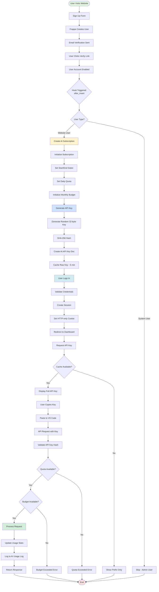
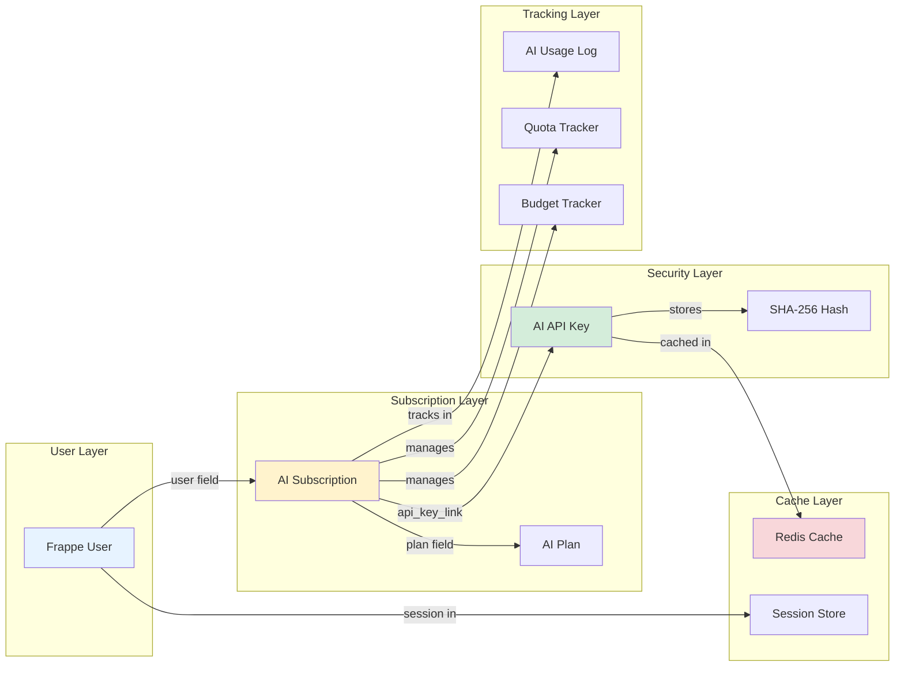
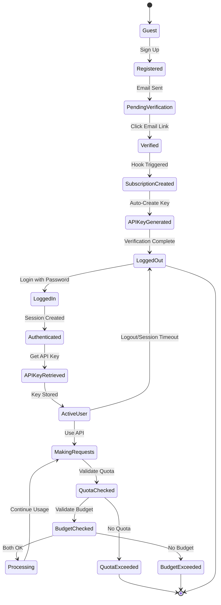
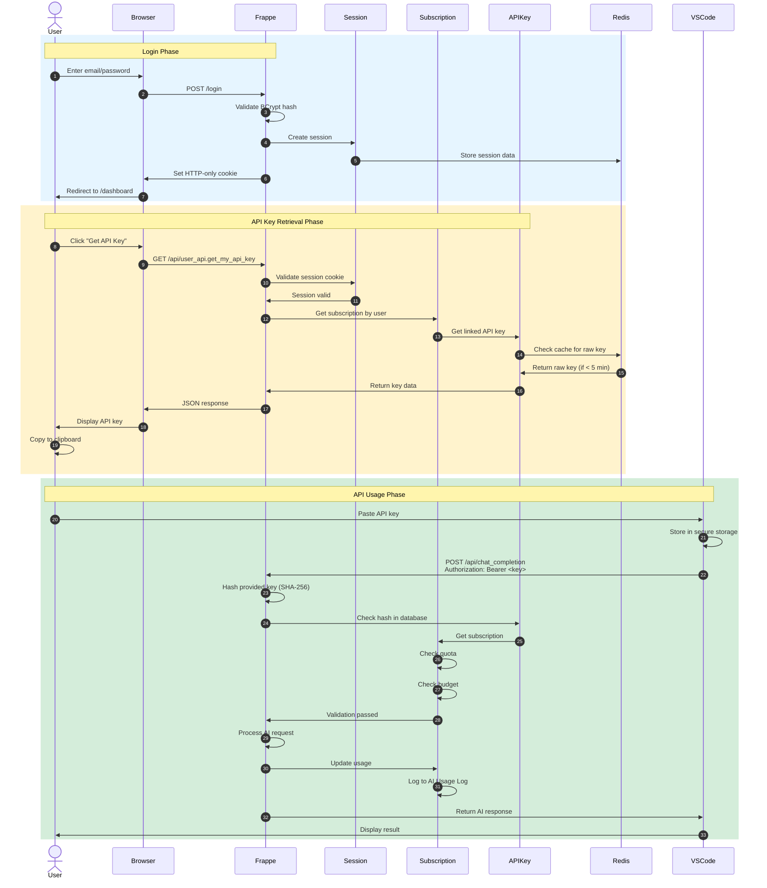
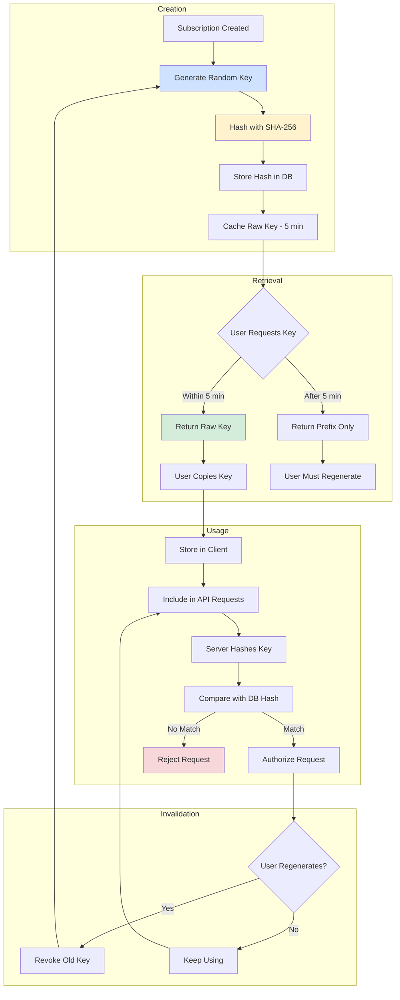
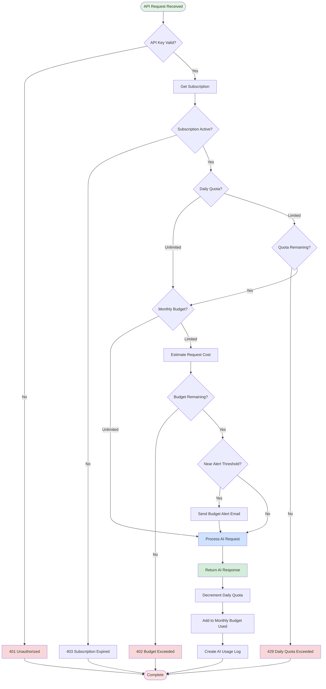
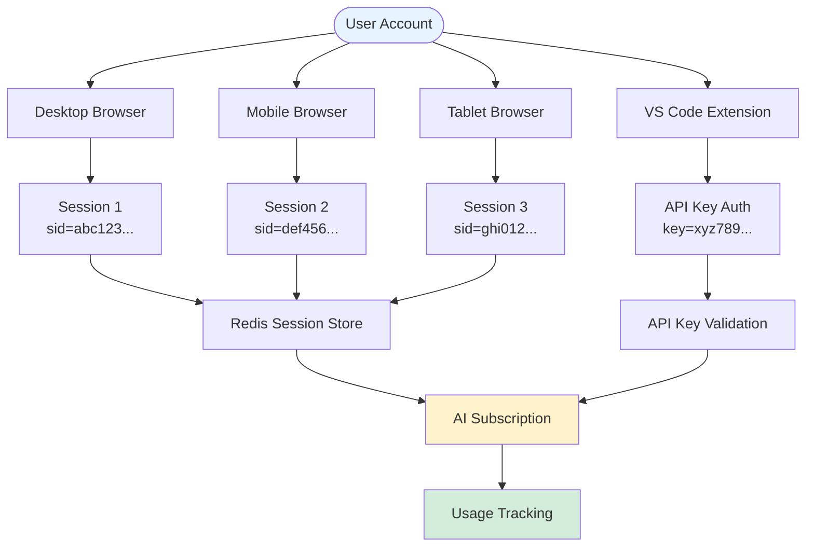
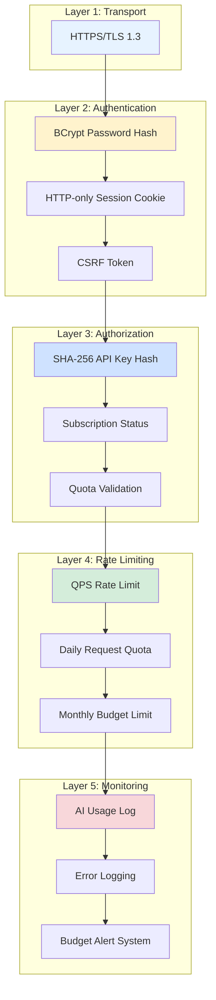

```mermaid
gantt
    title User Session Lifecycle
    dateFormat HH:mm
    axisFormat %H:%M
    
    section Login
    User submits credentials    :a1, 09:00, 1m
    Frappe validates password   :a2, after a1, 1m
    Session created             :a3, after a2, 1m
    Cookie set in browser       :a4, after a3, 1m
    
    section Active Session
    User browses dashboard      :b1, after a4, 30m
    Session auto-renewed        :b2, after b1, 1m
    User makes API request      :b3, after b2, 15m
    Session still valid         :b4, after b3, 1m
    
    section Inactivity
    User idle                   :c1, after b4, 4h
    Session expires warning     :c2, after c1, 1m
    Session timeout             :crit, c3, after c2, 1m
    
    section Re-login
    User returns                :d1, after c3, 10m
    Must login again            :d2, after d1, 2m
    New session created         :d3, after d2, 1m
```

```mermaid
graph LR
    subgraph "Frappe Core"
        A[User.insert] --> B[User.after_insert]
    end
    
    subgraph "Hook Registry"
        B --> C{hooks.py<br/>doc_events}
        C --> D[User: after_insert]
    end
    
    subgraph "User Utils"
        D --> E[create_default_subscription]
        E --> F{Check User Type}
        F -->|Website User| G[Continue]
        F -->|System User| H[Skip]
        G --> I{User Enabled?}
        I -->|Yes| J[Find Free Plan]
        I -->|No| H
    end
    
    subgraph "Subscription Creation"
        J --> K[Create AI Subscription]
        K --> L[before_insert hook]
        L --> M[set_dates]
        M --> N[set_quota]
        N --> O[initialize_monthly_budget]
        O --> P[Save to DB]
        P --> Q[after_insert hook]
        Q --> R[create_api_key]
    end
    
    subgraph "API Key Creation"
        R --> S[Generate Random Key]
        S --> T[Hash with SHA-256]
        T --> U[Create AI API Key Doc]
        U --> V[Cache Raw Key]
        V --> W[Link to Subscription]
    end
    
    W --> X([Complete])
    H --> X
    
    style A fill:#e7f3ff
    style K fill:#fff3cd
    style R fill:#cfe2ff
    style W fill:#d4edda
```

# 🎨 Visual Authentication Flow - Oropendola AI

## Quick Visual Reference for User Sign-In Process

---

## 🔄 **Complete Flow: Registration to API Usage**

---

## 🏗️ **System Architecture**

---

## 🔐 **Authentication & Authorization States**

---

## 📊 **Data Flow: Login to API Request**

---

## 🔑 **API Key Lifecycle**

---

## 📈 **Session Management Timeline**

---

## 🎯 **Quota & Budget Decision Tree**

---

## 🔄 **Hook Execution Flow**

---

## 📱 **Multi-Device Session Management**

---

## 🛡️ **Security Layers**

---

## 📚 **Related Documentation**

- [Complete User Sign-In Workflow](./USER_SIGNIN_WORKFLOW.md) - Detailed explanation
- [User API Quick Reference](./USER_API_QUICK_REF.md) - API endpoints
- [Frappe User Refactoring](./FRAPPE_USER_REFACTORING.md) - Architecture decisions

---

**Visual guide to understand the complete authentication and authorization flow in Oropendola AI!** 🚀
# 🎨 Visual Authentication Flow - Oropendola AI

## Quick Visual Reference for User Sign-In Process

---

## 🔄 **Complete Flow: Registration to API Usage**

---

## 🏗️ **System Architecture**

---

## 🔐 **Authentication & Authorization States**

---

## 📊 **Data Flow: Login to API Request**

---

## 🔑 **API Key Lifecycle**

---

## 📈 **Session Management Timeline**

---

## 🎯 **Quota & Budget Decision Tree**

---

## 🔄 **Hook Execution Flow**

---

## 📱 **Multi-Device Session Management**

---

## 🛡️ **Security Layers**

---

## 📚 **Related Documentation**

- [Complete User Sign-In Workflow](./USER_SIGNIN_WORKFLOW.md) - Detailed explanation
- [User API Quick Reference](./USER_API_QUICK_REF.md) - API endpoints
- [Frappe User Refactoring](./FRAPPE_USER_REFACTORING.md) - Architecture decisions

---

**Visual guide to understand the complete authentication and authorization flow in Oropendola AI!** 🚀
