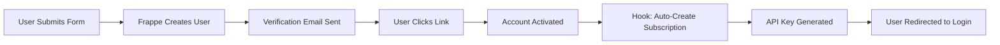

# 🎨 Frontend Developer Integration Guide - Oropendola AI

Complete guide for frontend developers to integrate with the Oropendola AI platform, including authentication, API usage, and best practices.

---

## 📋 Table of Contents

1. [Quick Start](#quick-start)
2. [Authentication Flow](#authentication-flow)
3. [Session Management](#session-management)
4. [API Key Integration](#api-key-integration)
5. [User API Endpoints](#user-api-endpoints)
6. [VS Code Extension APIs](#vs-code-extension-apis)
7. [Error Handling](#error-handling)
8. [Code Examples](#code-examples)
9. [Security Best Practices](#security-best-practices)
10. [Testing](#testing)

---

## 🚀 Quick Start

### **Base URL**
```
Production: https://oropendola.ai
```

### **Authentication URLs**
```javascript
const AUTH_URLS = {
  signup: 'https://oropendola.ai/login#signup',
  login: 'https://oropendola.ai/login#login',
  forgot: 'https://oropendola.ai/login#forgot',
  dashboard: 'https://oropendola.ai/dashboard'
};
```

### **API Base URLs**
```javascript
const API_BASE = {
  user: 'https://oropendola.ai/api/method/oropendola_ai.oropendola_ai.api.user_api',
  vscode: 'https://oropendola.ai/api/method/oropendola_ai.oropendola_ai.api.vscode_extension'
};
```

---

## 🔐 Authentication Flow

### **1. User Registration (Sign Up)**

**URL**: `https://oropendola.ai/login#signup`

#### **HTML Form Example**
```html
<form id="signupForm">
  <input type="text" name="full_name" placeholder="Full Name" required>
  <input type="email" name="email" placeholder="Email" required>
  <input type="password" name="password" placeholder="Password" required>
  <button type="submit">Sign Up</button>
</form>
```

#### **JavaScript Integration**
```javascript
// Redirect to signup page
function redirectToSignup() {
  window.location.href = 'https://oropendola.ai/login#signup';
}

// Or embed in iframe (if CORS allows)
function embedSignup() {
  const iframe = document.createElement('iframe');
  iframe.src = 'https://oropendola.ai/login#signup';
  iframe.width = '100%';
  iframe.height = '600px';
  document.getElementById('auth-container').appendChild(iframe);
}
```

#### **Post-Signup Flow**


**What Happens**:
1. Frappe creates User account (disabled)
2. Sends verification email
3. User clicks verification link
4. Account activated (`enabled: 1`)
5. **Auto-subscription created** via backend hook
6. **API key generated** automatically
7. User redirected to login page

---

### **2. User Login**

**URL**: `https://oropendola.ai/login#login`

#### **Redirect Method (Recommended)**
```javascript
function login() {
  // Save return URL
  sessionStorage.setItem('returnUrl', window.location.pathname);
  
  // Redirect to login
  window.location.href = 'https://oropendola.ai/login#login';
}
```

#### **Programmatic Login (Using Frappe API)**
```javascript
async function loginUser(email, password) {
  try {
    const response = await fetch('https://oropendola.ai/api/method/login', {
      method: 'POST',
      headers: {
        'Content-Type': 'application/json',
        'Accept': 'application/json'
      },
      credentials: 'include', // Important: include cookies
      body: JSON.stringify({
        usr: email,
        pwd: password
      })
    });

    const data = await response.json();

    if (data.message === 'Logged In') {
      console.log('Login successful!');
      console.log('User:', data.full_name);
      console.log('Home Page:', data.home_page);
      
      // Redirect to dashboard or return URL
      const returnUrl = sessionStorage.getItem('returnUrl') || '/dashboard';
      window.location.href = returnUrl;
      
      return { success: true, user: data };
    } else {
      throw new Error('Login failed');
    }
  } catch (error) {
    console.error('Login error:', error);
    return { success: false, error: error.message };
  }
}

// Usage
loginUser('user@example.com', 'password123')
  .then(result => {
    if (result.success) {
      console.log('Welcome,', result.user.full_name);
    } else {
      alert('Login failed: ' + result.error);
    }
  });
```

#### **Check Login Status**
```javascript
async function checkLoginStatus() {
  try {
    const response = await fetch('https://oropendola.ai/api/method/frappe.auth.get_logged_user', {
      credentials: 'include'
    });
    
    const data = await response.json();
    
    if (data.message && data.message !== 'Guest') {
      return {
        isLoggedIn: true,
        user: data.message
      };
    } else {
      return {
        isLoggedIn: false,
        user: null
      };
    }
  } catch (error) {
    console.error('Status check error:', error);
    return { isLoggedIn: false, user: null };
  }
}

// Usage
checkLoginStatus().then(status => {
  if (status.isLoggedIn) {
    console.log('Logged in as:', status.user);
  } else {
    console.log('Not logged in');
  }
});
```

---

### **3. Logout**

```javascript
async function logout() {
  try {
    const response = await fetch('https://oropendola.ai/api/method/logout', {
      method: 'POST',
      credentials: 'include'
    });

    if (response.ok) {
      console.log('Logged out successfully');
      window.location.href = '/';
    }
  } catch (error) {
    console.error('Logout error:', error);
  }
}
```

---

## 🎫 Session Management

### **Session Cookie**

Frappe uses HTTP-only cookies for session management:

```javascript
// Session cookie (set automatically by server)
// Name: sid
// Attributes: HttpOnly, Secure, SameSite=Lax
```

**Important**:
- ✅ Always use `credentials: 'include'` in fetch requests
- ✅ Cookie is HTTP-only (JavaScript cannot access)
- ✅ Automatically sent with every request
- ✅ CSRF token handled by Frappe

### **CSRF Token**

For state-changing requests (POST, PUT, DELETE):

```javascript
async function getCSRFToken() {
  const response = await fetch('https://oropendola.ai/api/method/frappe.auth.get_logged_user', {
    credentials: 'include'
  });
  
  // CSRF token in response headers
  const csrfToken = response.headers.get('X-Frappe-CSRF-Token');
  return csrfToken;
}

// Use in requests
async function makeAuthenticatedRequest(url, method, body) {
  const csrfToken = await getCSRFToken();
  
  const response = await fetch(url, {
    method: method,
    headers: {
      'Content-Type': 'application/json',
      'X-Frappe-CSRF-Token': csrfToken
    },
    credentials: 'include',
    body: JSON.stringify(body)
  });
  
  return response.json();
}
```

### **Session Expiry**

```javascript
// Check if session is still valid
async function isSessionValid() {
  const status = await checkLoginStatus();
  
  if (!status.isLoggedIn) {
    // Session expired - redirect to login
    sessionStorage.setItem('returnUrl', window.location.pathname);
    window.location.href = 'https://oropendola.ai/login#login';
    return false;
  }
  
  return true;
}

// Auto-check on page load
window.addEventListener('load', () => {
  isSessionValid();
});
```

---

## 🔑 API Key Integration

### **1. Get API Key (First Time)**

```javascript
async function getMyAPIKey() {
  try {
    const response = await fetch(
      'https://oropendola.ai/api/method/oropendola_ai.oropendola_ai.api.user_api.get_my_api_key',
      {
        method: 'POST',
        credentials: 'include',
        headers: {
          'Content-Type': 'application/json'
        }
      }
    );

    const data = await response.json();

    if (data.message.success) {
      if (data.message.api_key) {
        // Raw API key available (within 5 minutes of creation)
        console.log('⚠️ IMPORTANT: Save this API key securely!');
        console.log('API Key:', data.message.api_key);
        
        // Display to user with warning
        displayAPIKey(data.message.api_key, data.message.warning);
        
        return data.message.api_key;
      } else {
        // API key already retrieved
        console.log('API key already retrieved');
        console.log('Prefix:', data.message.api_key_prefix);
        console.log('Message:', data.message.message);
        
        // Show regenerate option
        showRegenerateOption();
      }
    } else {
      console.error('Error:', data.message.error);
    }
  } catch (error) {
    console.error('Failed to get API key:', error);
  }
}
```

### **2. Display API Key (UI Component)**

```javascript
function displayAPIKey(apiKey, warning) {
  const container = document.getElementById('api-key-container');
  
  container.innerHTML = `
    <div class="api-key-display">
      <div class="warning">${warning}</div>
      
      <div class="key-display">
        <input type="text" id="apiKeyInput" value="${apiKey}" readonly>
        <button onclick="copyAPIKey()">Copy</button>
      </div>
      
      <div class="instructions">
        <h3>Next Steps:</h3>
        <ol>
          <li>Click "Copy" to copy your API key</li>
          <li>Store it securely (password manager recommended)</li>
          <li>This key will NOT be shown again</li>
          <li>If lost, you'll need to regenerate a new key</li>
        </ol>
      </div>
    </div>
  `;
}

function copyAPIKey() {
  const input = document.getElementById('apiKeyInput');
  input.select();
  document.execCommand('copy');
  
  alert('API key copied to clipboard!');
}
```

### **3. Regenerate API Key**

```javascript
async function regenerateAPIKey() {
  // Confirm with user
  if (!confirm('This will revoke your current API key. Continue?')) {
    return;
  }

  try {
    const response = await fetch(
      'https://oropendola.ai/api/method/oropendola_ai.oropendola_ai.api.user_api.regenerate_api_key',
      {
        method: 'POST',
        credentials: 'include',
        headers: {
          'Content-Type': 'application/json'
        }
      }
    );

    const data = await response.json();

    if (data.message.success) {
      console.log('New API Key:', data.message.api_key);
      displayAPIKey(data.message.api_key, data.message.warning);
    } else {
      console.error('Error:', data.message.error);
    }
  } catch (error) {
    console.error('Failed to regenerate API key:', error);
  }
}
```

### **4. Store API Key Securely**

```javascript
// ❌ NEVER store in localStorage or sessionStorage
// ❌ NEVER expose in client-side code
// ❌ NEVER commit to version control

// ✅ Good: Use environment variables for server-side
// ✅ Good: Store in secure credential managers
// ✅ Good: Use backend proxy to hide key from frontend

// Example: Backend proxy
async function callAIWithBackendProxy(prompt) {
  // Frontend calls YOUR backend
  const response = await fetch('/api/ai/chat', {
    method: 'POST',
    headers: {
      'Content-Type': 'application/json'
    },
    body: JSON.stringify({ prompt })
  });
  
  return response.json();
}

// Your backend then uses the API key:
// const API_KEY = process.env.OROPENDOLA_API_KEY;
// fetch('https://oropendola.ai/api/method/...', {
//   headers: { 'Authorization': `Bearer ${API_KEY}` }
// });
```

---

## 📡 User API Endpoints

### **1. Get My Subscription**

```javascript
async function getMySubscription() {
  try {
    const response = await fetch(
      'https://oropendola.ai/api/method/oropendola_ai.oropendola_ai.api.user_api.get_my_subscription',
      {
        method: 'POST',
        credentials: 'include'
      }
    );

    const data = await response.json();

    if (data.message.success) {
      const subscription = data.message.subscription;
      
      console.log('Subscription ID:', subscription.id);
      console.log('Plan:', subscription.plan_title);
      console.log('Status:', subscription.status);
      console.log('Daily Quota:', subscription.daily_quota);
      console.log('Monthly Budget:', subscription.monthly_budget);
      
      return subscription;
    }
  } catch (error) {
    console.error('Failed to get subscription:', error);
  }
}
```

### **2. Display Subscription Dashboard**

```javascript
async function displayDashboard() {
  const subscription = await getMySubscription();
  
  if (!subscription) return;
  
  const dashboard = document.getElementById('dashboard');
  
  dashboard.innerHTML = `
    <div class="subscription-card">
      <h2>${subscription.plan_title}</h2>
      <p class="status ${subscription.status.toLowerCase()}">${subscription.status}</p>
      
      <div class="quota-info">
        <h3>Daily Quota</h3>
        <div class="progress-bar">
          <div class="progress" style="width: ${(subscription.daily_quota.remaining / subscription.daily_quota.limit) * 100}%"></div>
        </div>
        <p>${subscription.daily_quota.remaining} / ${subscription.daily_quota.limit} requests remaining</p>
      </div>
      
      <div class="budget-info">
        <h3>Monthly Budget</h3>
        <div class="progress-bar">
          <div class="progress" style="width: ${(subscription.monthly_budget.used / subscription.monthly_budget.limit) * 100}%"></div>
        </div>
        <p>$${subscription.monthly_budget.used.toFixed(2)} / $${subscription.monthly_budget.limit.toFixed(2)}</p>
        <p>Remaining: $${subscription.monthly_budget.remaining.toFixed(2)}</p>
      </div>
      
      <div class="dates">
        <p>Start: ${subscription.start_date}</p>
        ${subscription.end_date ? `<p>End: ${subscription.end_date}</p>` : ''}
      </div>
    </div>
  `;
}
```

---

## 🤖 VS Code Extension APIs

### **Using API Key for Programmatic Access**

```javascript
class OropendolaAI {
  constructor(apiKey) {
    this.apiKey = apiKey;
    this.baseURL = 'https://oropendola.ai/api/method/oropendola_ai.oropendola_ai.api.vscode_extension';
  }

  async request(endpoint, data) {
    try {
      const response = await fetch(`${this.baseURL}.${endpoint}`, {
        method: 'POST',
        headers: {
          'Content-Type': 'application/json',
          'Authorization': `Bearer ${this.apiKey}`
        },
        body: JSON.stringify(data)
      });

      if (!response.ok) {
        throw new Error(`HTTP ${response.status}: ${response.statusText}`);
      }

      return await response.json();
    } catch (error) {
      console.error(`API Error (${endpoint}):`, error);
      throw error;
    }
  }

  // Chat Completion
  async chatCompletion(messages, model = 'gpt-4') {
    return this.request('chat_completion', {
      messages,
      model,
      temperature: 0.7,
      max_tokens: 1000
    });
  }

  // Code Completion
  async codeCompletion(code, language, cursor_position) {
    return this.request('code_completion', {
      code,
      language,
      cursor_position
    });
  }

  // Code Explanation
  async explainCode(code, language) {
    return this.request('code_explanation', {
      code,
      language
    });
  }

  // Code Refactor
  async refactorCode(code, language, instructions) {
    return this.request('code_refactor', {
      code,
      language,
      instructions
    });
  }

  // Get Available Models
  async getAvailableModels() {
    return this.request('get_available_models', {});
  }

  // Get Usage Stats
  async getUsageStats() {
    return this.request('get_usage_stats', {});
  }

  // Validate API Key
  async validateAPIKey() {
    return this.request('validate_api_key', {
      api_key: this.apiKey
    });
  }
}

// Usage Example
const ai = new OropendolaAI('your-api-key-here');

// Chat
ai.chatCompletion([
  { role: 'user', content: 'Explain async/await in JavaScript' }
]).then(response => {
  console.log(response.message.choices[0].message.content);
});

// Code Explanation
ai.explainCode('const result = await fetch(url);', 'javascript')
  .then(response => {
    console.log('Explanation:', response.message.explanation);
  });

// Usage Stats
ai.getUsageStats().then(stats => {
  console.log('Today:', stats.message.today_usage);
  console.log('This Month:', stats.message.month_usage);
  console.log('Quota Remaining:', stats.message.quota_remaining);
});
```

---

## ⚠️ Error Handling

### **Comprehensive Error Handler**

```javascript
class APIError extends Error {
  constructor(message, code, details) {
    super(message);
    this.name = 'APIError';
    this.code = code;
    this.details = details;
  }
}

async function handleAPIRequest(requestFn) {
  try {
    const response = await requestFn();
    
    // Check for Frappe error response
    if (response.exc || response.exception) {
      throw new APIError(
        'Server Error',
        'SERVER_ERROR',
        response.exception || response.exc
      );
    }
    
    return response;
    
  } catch (error) {
    if (error instanceof APIError) {
      throw error;
    }
    
    // Network error
    if (error.name === 'TypeError' && error.message.includes('fetch')) {
      throw new APIError(
        'Network Error - Please check your connection',
        'NETWORK_ERROR',
        error
      );
    }
    
    // HTTP error
    if (error.status === 401) {
      throw new APIError(
        'Authentication required - Please log in',
        'AUTH_REQUIRED',
        error
      );
    }
    
    if (error.status === 403) {
      throw new APIError(
        'Access denied - Insufficient permissions',
        'ACCESS_DENIED',
        error
      );
    }
    
    if (error.status === 429) {
      throw new APIError(
        'Rate limit exceeded - Please try again later',
        'RATE_LIMIT',
        error
      );
    }
    
    if (error.status === 402) {
      throw new APIError(
        'Budget exceeded - Please upgrade your plan',
        'BUDGET_EXCEEDED',
        error
      );
    }
    
    // Generic error
    throw new APIError(
      'Unknown error occurred',
      'UNKNOWN_ERROR',
      error
    );
  }
}

// Usage
async function makeRequest() {
  try {
    const data = await handleAPIRequest(async () => {
      const response = await fetch('https://oropendola.ai/api/method/...', {
        credentials: 'include'
      });
      return response.json();
    });
    
    console.log('Success:', data);
    
  } catch (error) {
    if (error instanceof APIError) {
      // Show user-friendly message
      showErrorMessage(error.message, error.code);
      
      // Log details for debugging
      console.error('API Error:', error.code, error.details);
      
      // Handle specific cases
      if (error.code === 'AUTH_REQUIRED') {
        redirectToLogin();
      } else if (error.code === 'BUDGET_EXCEEDED') {
        showUpgradePrompt();
      }
    } else {
      // Unexpected error
      console.error('Unexpected error:', error);
      showErrorMessage('An unexpected error occurred');
    }
  }
}
```

---

## 💻 Code Examples

### **Complete React Integration**

```javascript
import React, { useState, useEffect } from 'react';

function OropendolaAIDashboard() {
  const [isLoggedIn, setIsLoggedIn] = useState(false);
  const [subscription, setSubscription] = useState(null);
  const [apiKey, setApiKey] = useState(null);
  const [loading, setLoading] = useState(true);

  useEffect(() => {
    checkAuth();
  }, []);

  async function checkAuth() {
    try {
      const response = await fetch(
        'https://oropendola.ai/api/method/frappe.auth.get_logged_user',
        { credentials: 'include' }
      );
      
      const data = await response.json();
      
      if (data.message && data.message !== 'Guest') {
        setIsLoggedIn(true);
        loadSubscription();
      } else {
        setIsLoggedIn(false);
      }
    } catch (error) {
      console.error('Auth check failed:', error);
    } finally {
      setLoading(false);
    }
  }

  async function loadSubscription() {
    try {
      const response = await fetch(
        'https://oropendola.ai/api/method/oropendola_ai.oropendola_ai.api.user_api.get_my_subscription',
        {
          method: 'POST',
          credentials: 'include'
        }
      );
      
      const data = await response.json();
      
      if (data.message.success) {
        setSubscription(data.message.subscription);
      }
    } catch (error) {
      console.error('Failed to load subscription:', error);
    }
  }

  async function loadAPIKey() {
    try {
      const response = await fetch(
        'https://oropendola.ai/api/method/oropendola_ai.oropendola_ai.api.user_api.get_my_api_key',
        {
          method: 'POST',
          credentials: 'include'
        }
      );
      
      const data = await response.json();
      
      if (data.message.success && data.message.api_key) {
        setApiKey(data.message.api_key);
      }
    } catch (error) {
      console.error('Failed to load API key:', error);
    }
  }

  function redirectToLogin() {
    window.location.href = 'https://oropendola.ai/login#login';
  }

  if (loading) {
    return <div>Loading...</div>;
  }

  if (!isLoggedIn) {
    return (
      <div>
        <h1>Welcome to Oropendola AI</h1>
        <button onClick={redirectToLogin}>Login</button>
      </div>
    );
  }

  return (
    <div className="dashboard">
      <h1>Dashboard</h1>
      
      {subscription && (
        <div className="subscription-info">
          <h2>{subscription.plan_title}</h2>
          <p>Status: {subscription.status}</p>
          
          <div className="quota">
            <h3>Daily Quota</h3>
            <progress 
              value={subscription.daily_quota.remaining} 
              max={subscription.daily_quota.limit}
            />
            <p>{subscription.daily_quota.remaining} / {subscription.daily_quota.limit}</p>
          </div>
          
          <div className="budget">
            <h3>Monthly Budget</h3>
            <progress 
              value={subscription.monthly_budget.used} 
              max={subscription.monthly_budget.limit}
            />
            <p>${subscription.monthly_budget.remaining.toFixed(2)} remaining</p>
          </div>
        </div>
      )}
      
      <div className="api-key-section">
        <h2>API Key</h2>
        <button onClick={loadAPIKey}>Show API Key</button>
        
        {apiKey && (
          <div className="api-key-display">
            <input type="text" value={apiKey} readOnly />
            <button onClick={() => navigator.clipboard.writeText(apiKey)}>
              Copy
            </button>
          </div>
        )}
      </div>
    </div>
  );
}

export default OropendolaAIDashboard;
```

### **Vue.js Integration**

```javascript
<template>
  <div class="oropendola-dashboard">
    <div v-if="loading">Loading...</div>
    
    <div v-else-if="!isLoggedIn">
      <h1>Welcome to Oropendola AI</h1>
      <button @click="login">Login</button>
    </div>
    
    <div v-else>
      <h1>Dashboard</h1>
      
      <div v-if="subscription" class="subscription">
        <h2>{{ subscription.plan_title }}</h2>
        <p>Status: {{ subscription.status }}</p>
        
        <div class="quota">
          <h3>Daily Quota</h3>
          <progress 
            :value="subscription.daily_quota.remaining" 
            :max="subscription.daily_quota.limit"
          />
          <p>{{ subscription.daily_quota.remaining }} / {{ subscription.daily_quota.limit }}</p>
        </div>
      </div>
      
      <div class="api-key">
        <h2>API Key</h2>
        <button @click="getAPIKey">Get API Key</button>
        
        <div v-if="apiKey">
          <input type="text" :value="apiKey" readonly />
          <button @click="copyKey">Copy</button>
        </div>
      </div>
    </div>
  </div>
</template>

<script>
export default {
  name: 'OropendolaDashboard',
  data() {
    return {
      loading: true,
      isLoggedIn: false,
      subscription: null,
      apiKey: null
    };
  },
  async mounted() {
    await this.checkAuth();
  },
  methods: {
    async checkAuth() {
      try {
        const response = await fetch(
          'https://oropendola.ai/api/method/frappe.auth.get_logged_user',
          { credentials: 'include' }
        );
        
        const data = await response.json();
        this.isLoggedIn = data.message && data.message !== 'Guest';
        
        if (this.isLoggedIn) {
          await this.loadSubscription();
        }
      } catch (error) {
        console.error('Auth error:', error);
      } finally {
        this.loading = false;
      }
    },
    
    async loadSubscription() {
      try {
        const response = await fetch(
          'https://oropendola.ai/api/method/oropendola_ai.oropendola_ai.api.user_api.get_my_subscription',
          {
            method: 'POST',
            credentials: 'include'
          }
        );
        
        const data = await response.json();
        if (data.message.success) {
          this.subscription = data.message.subscription;
        }
      } catch (error) {
        console.error('Subscription error:', error);
      }
    },
    
    async getAPIKey() {
      try {
        const response = await fetch(
          'https://oropendola.ai/api/method/oropendola_ai.oropendola_ai.api.user_api.get_my_api_key',
          {
            method: 'POST',
            credentials: 'include'
          }
        );
        
        const data = await response.json();
        if (data.message.success && data.message.api_key) {
          this.apiKey = data.message.api_key;
        }
      } catch (error) {
        console.error('API key error:', error);
      }
    },
    
    login() {
      window.location.href = 'https://oropendola.ai/login#login';
    },
    
    copyKey() {
      navigator.clipboard.writeText(this.apiKey);
      alert('API key copied!');
    }
  }
};
</script>
```

---

## 🔒 Security Best Practices

### **1. NEVER Expose API Keys in Frontend**

```javascript
// ❌ WRONG - API key in frontend code
const API_KEY = 'sk_live_abc123...';

fetch('https://oropendola.ai/api/method/...', {
  headers: {
    'Authorization': `Bearer ${API_KEY}` // Exposed!
  }
});

// ✅ CORRECT - Use backend proxy
// Frontend
fetch('/api/my-backend/ai-chat', {
  method: 'POST',
  body: JSON.stringify({ prompt: 'Hello' })
});

// Backend (Node.js example)
app.post('/api/my-backend/ai-chat', async (req, res) => {
  const API_KEY = process.env.OROPENDOLA_API_KEY; // Secure!
  
  const response = await fetch('https://oropendola.ai/api/method/...', {
    headers: {
      'Authorization': `Bearer ${API_KEY}`
    },
    body: JSON.stringify(req.body)
  });
  
  res.json(await response.json());
});
```

### **2. Use Session-Based Auth for User Features**

```javascript
// ✅ CORRECT - Use session cookies for user dashboard
async function getUserSubscription() {
  const response = await fetch(
    'https://oropendola.ai/api/method/oropendola_ai.oropendola_ai.api.user_api.get_my_subscription',
    {
      credentials: 'include' // Session cookie
    }
  );
  
  return response.json();
}
```

### **3. Implement CSRF Protection**

```javascript
let csrfToken = null;

async function getCSRFToken() {
  if (csrfToken) return csrfToken;
  
  const response = await fetch('https://oropendola.ai/api/method/frappe.auth.get_logged_user', {
    credentials: 'include'
  });
  
  csrfToken = response.headers.get('X-Frappe-CSRF-Token');
  return csrfToken;
}

async function makeSecureRequest(url, data) {
  const token = await getCSRFToken();
  
  return fetch(url, {
    method: 'POST',
    credentials: 'include',
    headers: {
      'Content-Type': 'application/json',
      'X-Frappe-CSRF-Token': token
    },
    body: JSON.stringify(data)
  });
}
```

### **4. Validate SSL/TLS**

```javascript
// ✅ Always use HTTPS
const API_BASE = 'https://oropendola.ai'; // Secure

// ❌ Never use HTTP
// const API_BASE = 'http://oropendola.ai'; // Insecure!
```

### **5. Handle Sensitive Data**

```javascript
// ✅ CORRECT - Don't log sensitive data
async function getAPIKey() {
  const response = await fetch('...');
  const data = await response.json();
  
  // DON'T: console.log('API Key:', data.api_key);
  
  // DO: Show to user securely
  displayAPIKeySecurely(data.api_key);
}

function displayAPIKeySecurely(key) {
  // One-time display
  const modal = createModal();
  modal.innerHTML = `
    <div class="warning">⚠️ Save this key now! It won't be shown again.</div>
    <input type="text" value="${key}" readonly>
    <button onclick="copyAndClose()">Copy & Close</button>
  `;
  
  // Clear after user copies
  function copyAndClose() {
    navigator.clipboard.writeText(key);
    modal.remove();
  }
}
```

---

## 🧪 Testing

### **Unit Tests (Jest)**

```javascript
import { checkLoginStatus, loginUser, getMySubscription } from './oropendola-api';

// Mock fetch
global.fetch = jest.fn();

describe('Oropendola API', () => {
  afterEach(() => {
    fetch.mockClear();
  });

  test('checkLoginStatus returns logged-in user', async () => {
    fetch.mockResolvedValueOnce({
      json: async () => ({ message: 'user@example.com' })
    });

    const result = await checkLoginStatus();
    
    expect(result.isLoggedIn).toBe(true);
    expect(result.user).toBe('user@example.com');
  });

  test('checkLoginStatus returns guest', async () => {
    fetch.mockResolvedValueOnce({
      json: async () => ({ message: 'Guest' })
    });

    const result = await checkLoginStatus();
    
    expect(result.isLoggedIn).toBe(false);
  });

  test('loginUser succeeds', async () => {
    fetch.mockResolvedValueOnce({
      json: async () => ({
        message: 'Logged In',
        full_name: 'John Doe'
      })
    });

    const result = await loginUser('user@example.com', 'password');
    
    expect(result.success).toBe(true);
    expect(result.user.full_name).toBe('John Doe');
  });

  test('getMySubscription returns data', async () => {
    fetch.mockResolvedValueOnce({
      json: async () => ({
        message: {
          success: true,
          subscription: {
            plan_title: 'Free Plan',
            status: 'Active'
          }
        }
      })
    });

    const result = await getMySubscription();
    
    expect(result.plan_title).toBe('Free Plan');
    expect(result.status).toBe('Active');
  });
});
```

### **Integration Tests (Cypress)**

```javascript
describe('Oropendola AI Integration', () => {
  it('User can sign up and login', () => {
    // Visit signup page
    cy.visit('https://oropendola.ai/login#signup');
    
    // Fill form
    cy.get('[name="full_name"]').type('Test User');
    cy.get('[name="email"]').type('test@example.com');
    cy.get('[name="password"]').type('SecurePassword123!');
    
    // Submit
    cy.get('form').submit();
    
    // Check for verification message
    cy.contains('Verification email sent');
  });

  it('User can view dashboard', () => {
    // Login first
    cy.visit('https://oropendola.ai/login#login');
    cy.get('[name="email"]').type('user@example.com');
    cy.get('[name="password"]').type('password');
    cy.get('form').submit();
    
    // Should redirect to dashboard
    cy.url().should('include', '/dashboard');
    
    // Check for subscription info
    cy.contains('Free Plan');
    cy.contains('Daily Quota');
  });

  it('User can get API key', () => {
    // Already logged in
    cy.visit('https://oropendola.ai/dashboard');
    
    // Click get API key button
    cy.contains('Get API Key').click();
    
    // API key should be displayed
    cy.get('[data-testid="api-key-display"]').should('be.visible');
    
    // Copy button should work
    cy.get('[data-testid="copy-button"]').click();
    cy.contains('Copied');
  });
});
```

---

## 📚 Related Documentation

- [User Sign-In Workflow](./USER_SIGNIN_WORKFLOW.md) - Complete authentication flow
- [Oropendola URLs Reference](./OROPENDOLA_URLS.md) - All system URLs
- [User API Quick Reference](./USER_API_QUICK_REF.md) - API endpoint details
- [VS Code Extension API](./VSCODE_EXTENSION_API.md) - Extension integration
- [Authentication Flow Visual](./AUTHENTICATION_FLOW_VISUAL.md) - Visual diagrams

---

## 🎉 Summary

**Frontend Integration Checklist**:

✅ Understand authentication flow (sign up → verify → login)  
✅ Use session cookies for user features (`credentials: 'include'`)  
✅ Never expose API keys in frontend code  
✅ Use backend proxy for API key-based requests  
✅ Implement proper error handling  
✅ Handle session expiry gracefully  
✅ Display API keys securely (one-time, with warning)  
✅ Use HTTPS only  
✅ Implement CSRF protection for state-changing requests  
✅ Test thoroughly (unit + integration)

**You're ready to integrate with Oropendola AI!** 🚀
