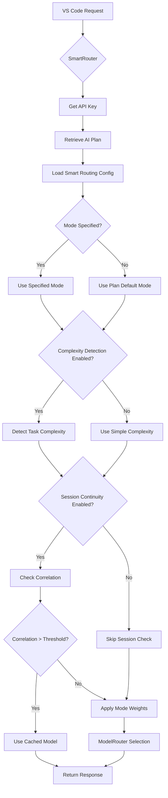

# 🎛️ Smart Routing Configuration Guide

## Overview

Oropendola AI now features **configurable Smart Routing** directly in the AI Plan DocType, giving administrators full visibility and control over intelligent model routing behavior.

---

## 📍 Configuration Location

### **Where to Configure:**

**Navigate to**: `AI Plan` DocType

**Path**: Oropendola AI → AI Plan → [Select Plan] → **Smart Routing Configuration** section

---

## 🎯 Configuration Fields

### 1. **Default Routing Mode** (Required)

**Field**: `default_routing_mode`  
**Type**: Select  
**Options**:
- `auto` - Smart balance between cost and quality (Recommended)
- `performance` - Quality-first, cost-second
- `efficient` - Cost-first, quality-second
- `lite` - Free-tier only

**Description**: The default smart routing mode for this plan when users don't explicitly specify a mode.

**Default**: `auto`

**Examples**:
```
Free Plan → "efficient" (maximize cost savings)
Pro Plan → "auto" (balance cost and quality)
Enterprise Plan → "performance" (maximize quality)
```

---

### 2. **Enable Session Continuity**

**Field**: `enable_session_continuity`  
**Type**: Check  
**Default**: ✅ Enabled

**Description**: Maintain model consistency across conversation sessions for better context understanding.

**How it works**:
- Tracks conversation topics using similarity detection
- If similarity > threshold, reuses same model
- If similarity < threshold, re-evaluates model selection

**Benefits**:
- ✅ Better follow-up responses
- ✅ Consistent conversation quality
- ✅ Reduced context switching overhead

---

### 3. **Session TTL (seconds)**

**Field**: `session_ttl`  
**Type**: Int  
**Default**: `3600` (1 hour)  
**Depends on**: `enable_session_continuity` = ✅

**Description**: How long to cache model selection for a session.

**Recommendations**:
```
Quick sessions: 1800 (30 minutes)
Normal use: 3600 (1 hour)
Long sessions: 7200 (2 hours)
```

---

### 4. **Enable Task Complexity Detection**

**Field**: `enable_task_complexity_detection`  
**Type**: Check  
**Default**: ✅ Enabled

**Description**: Automatically detect task complexity from prompts and route to appropriate models.

**Complexity Levels**:
- **Simple** → DeepSeek (cheap, fast)
- **Reasoning** → Grok (good for logic)
- **Complex** → Claude (best for reviews)
- **Multimodal** → Gemini (visuals, large context)

**Detection Method**:
- Regex pattern matching on prompt text
- Token count analysis
- Prompt length evaluation

---

### 5. **Correlation Threshold**

**Field**: `correlation_threshold`  
**Type**: Float  
**Default**: `0.7`  
**Range**: `0.0 - 1.0`  
**Depends on**: `enable_session_continuity` = ✅

**Description**: Similarity threshold for maintaining session continuity. Higher = stricter.

**How it works**:
```python
# Calculate similarity between current and previous prompt
similarity = len(common_words) / len(total_words)

if similarity > correlation_threshold:
    # High correlation - use same model
    model = cached_model
else:
    # Low correlation - re-evaluate
    model = select_best_model()
```

**Recommendations**:
```
Strict continuity: 0.8-0.9 (only very similar topics)
Normal: 0.7 (related topics)
Loose: 0.5-0.6 (any related keywords)
```

**Examples**:
```
Prompt 1: "Explain Python decorators"
Prompt 2: "Show me an example with @property"
Similarity: 0.85 → Use same model ✅

Prompt 1: "Explain Python decorators"
Prompt 2: "Now review this entire codebase"
Similarity: 0.15 → Select new model ❌
```

---

### 6. **Monthly Budget Limit**

**Field**: `monthly_budget_limit`  
**Type**: Currency  
**Default**: `0` (unlimited)

**Description**: Monthly spending limit in plan currency. System alerts when approaching limit.

**How it works**:
- Tracks actual API costs per month
- Sends alerts at 80%, 90%, 100%
- Can automatically switch to cheaper models near limit

**Examples**:
```
Free Plan: INR 0 (no budget, use free tier)
Pro Plan: INR 1,200
Enterprise: INR 10,000
```

---

## 📊 Configuration Examples

### Free Plan (Cost-Optimized)

```
Default Routing Mode: efficient
Enable Session Continuity: ✅ Yes
Session TTL: 1800 (30 minutes)
Enable Task Complexity Detection: ✅ Yes
Correlation Threshold: 0.6 (loose)
Monthly Budget Limit: INR 500
```

**Behavior**:
- Defaults to DeepSeek (cheapest) for most tasks
- Uses Grok only for reasoning tasks
- Avoids premium models (Claude/GPT-4)
- Short session cache
- Switches models frequently to save cost

---

### Pro Plan (Balanced)

```
Default Routing Mode: auto
Enable Session Continuity: ✅ Yes
Session TTL: 3600 (1 hour)
Enable Task Complexity Detection: ✅ Yes
Correlation Threshold: 0.7 (normal)
Monthly Budget Limit: INR 1,200
```

**Behavior**:
- Intelligently routes based on task type
- Simple → DeepSeek
- Reasoning → Grok
- Complex → Claude
- Multimodal → Gemini
- Good session continuity
- Balanced cost/quality

---

### Enterprise Plan (Quality-First)

```
Default Routing Mode: performance
Enable Session Continuity: ✅ Yes
Session TTL: 7200 (2 hours)
Enable Task Complexity Detection: ✅ Yes
Correlation Threshold: 0.8 (strict)
Monthly Budget Limit: INR 10,000
```

**Behavior**:
- Prioritizes Claude and GPT-4 for all tasks
- Long session cache for better context
- Strict correlation for consistency
- Higher budget allows premium models

---

## 🔧 How Configuration Works with Routing

### Step-by-Step Flow



---

## 💡 Best Practices

### 1. **Start with Auto Mode**

```
✅ Good: default_routing_mode = "auto"
❌ Avoid: default_routing_mode = "performance" (expensive!)
```

**Reason**: Auto mode provides best cost/quality balance for most use cases.

---

### 2. **Enable Both Features**

```
✅ Good:
  enable_session_continuity = true
  enable_task_complexity_detection = true

❌ Avoid: Disabling both (loses smart routing benefits)
```

---

### 3. **Set Reasonable Thresholds**

```
✅ Good: correlation_threshold = 0.7 (70% similarity)
❌ Too Strict: correlation_threshold = 0.95 (rarely matches)
❌ Too Loose: correlation_threshold = 0.3 (matches unrelated)
```

---

### 4. **Configure Budget Alerts**

```
✅ Good: Set monthly_budget_limit to prevent overruns
❌ Avoid: unlimited budget without monitoring
```

---

## 📈 Monitoring & Analytics

### Where to View Configuration Impact

**1. AI Usage Logs**
- Shows which model was selected
- Task complexity detected
- Mode used
- Session continuity status

**2. Cost Reports**
- Monthly spend by model
- Budget utilization
- Cost per complexity type

**3. Response Metadata**

Every API response includes configuration details:

```json
{
  "status": 200,
  "model": "Claude",
  "smart_mode": "auto",
  "task_complexity": "complex",
  "plan_config_used": {
    "default_mode": "auto",
    "session_continuity_enabled": true,
    "complexity_detection_enabled": true
  }
}
```

---

## 🔄 Dynamic Updates

### Changing Configuration

**Changes take effect immediately** for new requests.

**Example**:
```
1. Admin changes Free Plan: efficient → auto
2. Save
3. Next user request uses auto mode ✅
```

**No restart required!**

---

## 🎯 Common Scenarios

### Scenario 1: Reduce Costs

**Problem**: Budget exceeded mid-month

**Solution**:
```
1. Change default_routing_mode: auto → efficient
2. Lower monthly_budget_limit
3. System automatically routes to cheaper models
```

---

### Scenario 2: Improve Quality

**Problem**: Users complain about response quality

**Solution**:
```
1. Change default_routing_mode: efficient → auto
2. Or enable: performance mode for specific plans
3. Increase monthly_budget_limit
```

---

### Scenario 3: Better Conversations

**Problem**: Follow-up questions get poor responses

**Solution**:
```
1. Enable session_continuity: ✅
2. Increase session_ttl: 3600 → 7200
3. Adjust correlation_threshold: 0.7 → 0.6 (more lenient)
```

---

## 📚 Related Documentation

- **Smart Routing Modes**: [`SMART_ROUTING_MODES.md`](./SMART_ROUTING_MODES.md)
- **Router Architecture**: [`ROUTER_ARCHITECTURE_EXPLAINED.md`](./ROUTER_ARCHITECTURE_EXPLAINED.md)
- **Cost Implementation**: [`COST_WEIGHT_IMPLEMENTATION_SUMMARY.md`](./COST_WEIGHT_IMPLEMENTATION_SUMMARY.md)

---

## ✅ Summary

**Before** (Hardcoded):
- ❌ No administrator visibility
- ❌ Must edit code to change behavior
- ❌ No per-plan customization

**After** (Configurable):
- ✅ Full administrator visibility
- ✅ Configure via UI
- ✅ Per-plan customization
- ✅ Real-time updates
- ✅ Budget tracking

**Result**: Administrators have complete control over smart routing behavior! 🎉
