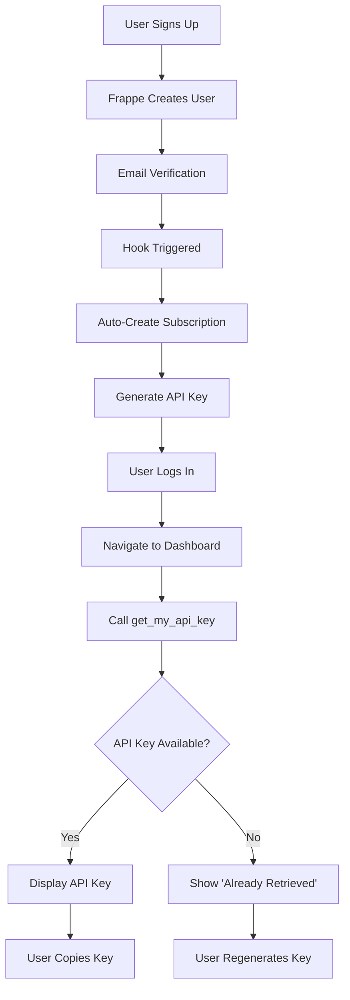

# 🚀 User API Quick Reference

## Base URL
```
https://oropendola.ai/api/method/oropendola_ai.oropendola_ai.api.user_api
```

---

## 📍 API Endpoints

### **1. Get My API Key**

**Endpoint**: `.get_my_api_key`

**Auth**: ✅ Required (logged-in user)

**Method**: POST/GET

**Request**:
```bash
curl https://oropendola.ai/api/method/oropendola_ai.oropendola_ai.api.user_api.get_my_api_key \
  -H "Cookie: sid=<session_cookie>" \
  -X POST
```

**Response** (First Time):
```json
{
  "success": true,
  "api_key": "xyz789abc123def456...",
  "api_key_prefix": "xyz789ab",
  "subscription_id": "SUB-2025-00001",
  "plan": "free",
  "status": "Active",
  "warning": "⚠️ Store it securely - it will not be shown again!"
}
```

**Response** (Already Retrieved):
```json
{
  "success": true,
  "api_key": null,
  "api_key_prefix": "xyz789ab",
  "subscription_id": "SUB-2025-00001",
  "plan": "free",
  "status": "Active",
  "message": "API key already retrieved. Please regenerate if lost."
}
```

---

### **2. Get My Subscription**

**Endpoint**: `.get_my_subscription`

**Auth**: ✅ Required

**Response**:
```json
{
  "success": true,
  "subscription": {
    "id": "SUB-2025-00001",
    "plan_id": "free",
    "plan_title": "Free Plan",
    "status": "Active",
    "start_date": "2025-10-27",
    "end_date": null,
    "daily_quota": {
      "limit": 100,
      "remaining": 85
    },
    "monthly_budget": {
      "limit": 500,
      "used": 120,
      "remaining": 380
    }
  }
}
```

---

### **3. Regenerate API Key**

**Endpoint**: `.regenerate_api_key`

**Auth**: ✅ Required

**Response**:
```json
{
  "success": true,
  "api_key": "new_key_abc123def456...",
  "api_key_prefix": "new_key_",
  "warning": "⚠️ Store this securely!"
}
```

**Effect**:
- ❌ Revokes old API key
- ✅ Creates new API key
- ✅ Updates subscription

---

## 🔐 Authentication

### **Standard Frappe Login**

All endpoints require user to be logged in via standard Frappe session.

**Login**:
```bash
curl https://oropendola.ai/api/method/login \
  -X POST \
  -H "Content-Type: application/json" \
  -d '{
    "usr": "user@example.com",
    "pwd": "password123"
  }'
```

**Response**:
```json
{
  "message": "Logged In",
  "home_page": "/dashboard",
  "full_name": "John Doe"
}
```

**Session Cookie**: `sid=<session_cookie>`

---

## 📝 Usage Examples

### **JavaScript (Browser)**

```javascript
// User is already logged in (has session cookie)

async function getMyAPIKey() {
  const response = await fetch('/api/method/oropendola_ai.oropendola_ai.api.user_api.get_my_api_key', {
    method: 'POST',
    credentials: 'include'  // Important: include session cookie
  });
  
  const data = await response.json();
  
  if (data.success && data.api_key) {
    console.log('Your API Key:', data.api_key);
    // Store securely
    localStorage.setItem('oropendola_api_key', data.api_key);
  } else {
    console.log('API key already retrieved or not available');
  }
}

async function getMySubscription() {
  const response = await fetch('/api/method/oropendola_ai.oropendola_ai.api.user_api.get_my_subscription', {
    method: 'POST',
    credentials: 'include'
  });
  
  const data = await response.json();
  
  if (data.success) {
    console.log('Subscription:', data.subscription);
    console.log('Daily Quota Remaining:', data.subscription.daily_quota.remaining);
    console.log('Monthly Budget Remaining:', data.subscription.monthly_budget.remaining);
  }
}
```

---

### **Python**

```python
import requests

# Login first
session = requests.Session()
login_response = session.post(
    'https://oropendola.ai/api/method/login',
    json={
        'usr': 'user@example.com',
        'pwd': 'password123'
    }
)

# Get API key
api_key_response = session.post(
    'https://oropendola.ai/api/method/oropendola_ai.oropendola_ai.api.user_api.get_my_api_key'
)

data = api_key_response.json()
if data['success'] and data.get('api_key'):
    print(f"Your API Key: {data['api_key']}")
```

---

### **cURL**

```bash
# 1. Login and save cookies
curl -c cookies.txt \
  -X POST \
  -H "Content-Type: application/json" \
  -d '{"usr":"user@example.com","pwd":"password123"}' \
  https://oropendola.ai/api/method/login

# 2. Get API key using saved cookies
curl -b cookies.txt \
  -X POST \
  https://oropendola.ai/api/method/oropendola_ai.oropendola_ai.api.user_api.get_my_api_key

# 3. Get subscription details
curl -b cookies.txt \
  -X POST \
  https://oropendola.ai/api/method/oropendola_ai.oropendola_ai.api.user_api.get_my_subscription

# 4. Regenerate API key
curl -b cookies.txt \
  -X POST \
  https://oropendola.ai/api/method/oropendola_ai.oropendola_ai.api.user_api.regenerate_api_key
```

---

## 🎯 Error Responses

### **Not Logged In**
```json
{
  "success": false,
  "error": "Authentication required. Please log in."
}
```

### **No Subscription**
```json
{
  "success": false,
  "error": "No active subscription found. Please subscribe to a plan."
}
```

### **No API Key**
```json
{
  "success": false,
  "error": "No API key found. Please contact support."
}
```

---

## 🔄 User Flow



---

## 📊 Comparison: Old vs New

| Feature | Old (AI Customer) | New (Frappe User) |
|---------|------------------|-------------------|
| **Auth Endpoint** | Custom `/auth/initiate_signin` | Standard `/login` |
| **Email Verification** | Custom implementation | Frappe built-in |
| **Get API Key** | `/auth/get_api_key` (complex) | `/user_api.get_my_api_key` (simple) |
| **Session Management** | State tokens + polling | Frappe sessions |
| **Social Login** | Not available | ✅ Built-in |
| **Password Reset** | Not available | ✅ Built-in |
| **2FA** | Not available | ✅ Available |

---

## ✅ Quick Checklist

### **For Frontend Developers**

- [ ] Use Frappe's standard `/signup` page
- [ ] Use Frappe's standard `/login` page
- [ ] Call `get_my_api_key()` after login
- [ ] Display API key with warning
- [ ] Store API key securely (not in localStorage!)
- [ ] Show subscription details via `get_my_subscription()`

### **For VS Code Extension**

- [ ] Show login instructions
- [ ] Direct user to `https://oropendola.ai/login`
- [ ] User copies API key from dashboard
- [ ] User pastes into extension
- [ ] Extension validates API key
- [ ] Store in VS Code secure storage

---

## 🚀 **Summary**

**Simple, Standard, Secure!**

- ✅ Use Frappe's built-in login
- ✅ Auto-subscription creation
- ✅ Simple API key retrieval
- ✅ Standard session management
- ✅ No polling, no state tokens
- ✅ Production-ready!

**Read More**: [`FRAPPE_USER_REFACTORING.md`](./FRAPPE_USER_REFACTORING.md)
