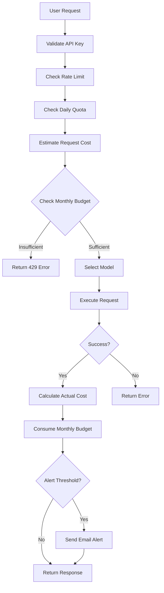

# 💳 User-Based Monthly Budget Tracking

## Overview

Oropendola AI now implements **per-user monthly budget tracking**, ensuring each user's AI model usage is tracked and limited according to their individual plan allocation, rather than sharing a pooled budget across multiple users.

---

## 🎯 Key Features

### ✅ Individual User Budgets
- **Each user gets their own monthly budget**
- Inherited from AI Plan's `monthly_budget_limit`
- Tracked separately per subscription
- No shared budget pool

### ✅ Automatic Monthly Resets
- Budget resets on the first day of each month
- Automatic rollover tracking
- No manual intervention required

### ✅ Real-Time Budget Checks
- **Before** each AI request
- Estimated cost validation
- Prevents budget overruns

### ✅ Accurate Cost Tracking
- **After** each successful request
- Actual token usage calculation
- Model-specific cost per unit

### ✅ Budget Alerts
- Email notifications at 90% threshold (configurable)
- Prevents service interruption
- One alert per month (cached)

---

## 📊 New Fields in AI Subscription

### Monthly Budget Tracking Section

| Field | Type | Description |
|-------|------|-------------|
| **monthly_budget_limit** | Currency | Monthly spending limit (from AI Plan) |
| **monthly_budget_used** | Currency | Total cost incurred in current month |
| **current_month_start** | Date | Start of current billing month |
| **budget_alert_threshold** | Float | Alert threshold (0.0-1.0, default: 0.9) |

---

## 🔄 How It Works

### Request Flow with Budget Tracking



---

## 💰 Cost Estimation & Tracking

### Before Request (Estimation)

```python
# ModelRouter estimates cost before execution
estimated_tokens = payload.get("max_tokens", 1000)
estimated_cost = (estimated_tokens / 1000) * 0.01  # Rough estimate

# Check if user has budget
budget_ok, message, remaining = check_monthly_budget(
    subscription_id,
    estimated_cost
)

if not budget_ok:
    return {
        "status": 429,
        "error": "Monthly budget exceeded",
        "message": message,
        "budget_remaining": remaining
    }
```

### After Request (Actual Tracking)

```python
# Calculate actual cost based on real token usage
tokens_input = payload.get("tokens_input", estimated_tokens)
tokens_output = response.get("tokens_output", estimated_tokens)

# Get model's cost per unit
model_cost_per_unit = float(selected_model.cost_per_unit or 0.01)
actual_cost = ((tokens_input + tokens_output) / 1000) * model_cost_per_unit

# Consume budget for this user
consume_monthly_budget(subscription_id, actual_cost)
```

---

## 📈 Budget Tracking Methods

### 1. `check_monthly_budget(estimated_cost)`

**Location**: [`ai_subscription.py`](file:///home/frappe/frappe-bench/apps/oropendola_ai/oropendola_ai/oropendola_ai/doctype/ai_subscription/ai_subscription.py#L179-L218)

**Purpose**: Validate budget **before** request

**Returns**: `(allowed: bool, message: str, remaining: float)`

**Example**:
```python
subscription = frappe.get_doc("AI Subscription", subscription_id)
allowed, message, remaining = subscription.check_monthly_budget(0.05)

if not allowed:
    # Insufficient budget
    print(f"Budget exceeded: {message}")
else:
    # Proceed with request
    print(f"Remaining budget: {remaining}")
```

---

### 2. `consume_monthly_budget(cost)`

**Location**: [`ai_subscription.py`](file:///home/frappe/frappe-bench/apps/oropendola_ai/oropendola_ai/oropendola_ai/doctype/ai_subscription/ai_subscription.py#L220-L232)

**Purpose**: Deduct actual cost **after** successful request

**Example**:
```python
subscription = frappe.get_doc("AI Subscription", subscription_id)
new_used = subscription.consume_monthly_budget(0.05)
print(f"Total used this month: {new_used}")
```

---

### 3. `reset_monthly_budget_if_needed()`

**Location**: [`ai_subscription.py`](file:///home/frappe/frappe-bench/apps/oropendola_ai/oropendola_ai/oropendola_ai/doctype/ai_subscription/ai_subscription.py#L234-L250)

**Purpose**: Automatically reset budget when new month starts

**Called**: 
- Before every budget check
- Before every budget consumption

**Example**:
```python
subscription.reset_monthly_budget_if_needed()
# If new month: monthly_budget_used = 0.0
```

---

### 4. `send_budget_alert(current_usage, remaining)`

**Location**: [`ai_subscription.py`](file:///home/frappe/frappe-bench/apps/oropendola_ai/oropendola_ai/oropendola_ai/doctype/ai_subscription/ai_subscription.py#L252-L286)

**Purpose**: Send email alert when threshold reached

**Features**:
- Sends only once per month (Redis cached)
- Configurable threshold (default: 90%)
- Includes current usage & remaining budget

**Example Email**:
```
Subject: Budget Alert: 92% Used - Oropendola AI

Hello,

Your Oropendola AI monthly budget has reached 90% of your limit.

- Budget Limit: 1200.00
- Current Usage: 1100.00 (92%)
- Remaining: 100.00

To avoid service interruption, please consider upgrading your plan.

Thank you,
Oropendola AI Team
```

---

### 5. `get_monthly_budget_stats()`

**Location**: [`ai_subscription.py`](file:///home/frappe/frappe-bench/apps/oropendola_ai/oropendola_ai/oropendola_ai/doctype/ai_subscription/ai_subscription.py#L288-L303)

**Purpose**: Get comprehensive budget statistics

**Returns**:
```json
{
  "monthly_budget_limit": 1200.0,
  "monthly_budget_used": 850.0,
  "monthly_budget_remaining": 350.0,
  "usage_percentage": 70.83,
  "current_month_start": "2025-10-01",
  "alert_threshold": 0.9,
  "unlimited": false
}
```

---

## 🌐 API Endpoint

### Get Monthly Budget Stats

**Endpoint**: `https://oropendola.ai/api/method/oropendola_ai.oropendola_ai.api.subscription.get_monthly_budget_stats`

**Method**: GET/POST

**Parameters**:
- `api_key` (string, required): User's API key

**Response**:
```json
{
  "success": true,
  "budget_stats": {
    "monthly_budget_limit": 1200.0,
    "monthly_budget_used": 850.0,
    "monthly_budget_remaining": 350.0,
    "usage_percentage": 70.83,
    "current_month_start": "2025-10-01",
    "alert_threshold": 0.9,
    "unlimited": false
  }
}
```

**Example Usage**:
```bash
curl -X POST https://oropendola.ai/api/method/oropendola_ai.oropendola_ai.api.subscription.get_monthly_budget_stats \
  -H "Content-Type: application/json" \
  -d '{
    "api_key": "your-api-key-here"
  }'
```

---

## 📝 Example Scenarios

### Scenario 1: Successful Request

```python
# User makes request
payload = {
    "messages": [...],
    "max_tokens": 2000  # Estimate 2000 tokens
}

# Step 1: Estimate cost
estimated_cost = (2000 / 1000) * 0.01 = 0.02  # $0.02

# Step 2: Check budget
budget_ok, msg, remaining = check_monthly_budget(sub_id, 0.02)
# Result: (True, "Budget check passed. Remaining: 1199.98", 1199.98)

# Step 3: Execute request
response = model.execute(payload)

# Step 4: Calculate actual cost
actual_tokens = 1500 + 800 = 2300  # Input + output
actual_cost = (2300 / 1000) * 0.01 = 0.023  # $0.023

# Step 5: Consume budget
consume_monthly_budget(sub_id, 0.023)
# New balance: 1199.977

# Return response with cost info
{
    "status": 200,
    "model": "DeepSeek",
    "response": {...},
    "cost": 0.023,
    "budget_remaining": 1199.977
}
```

---

### Scenario 2: Budget Exceeded

```python
# User has used $1195 out of $1200

# New request with estimated cost $10
estimated_cost = 10.0

# Check budget
budget_ok, msg, remaining = check_monthly_budget(sub_id, 10.0)
# Result: (False, "Insufficient budget. Required: 10.00, Remaining: 5.00", 5.0)

# Return error
{
    "status": 429,
    "error": "Monthly budget exceeded",
    "message": "Insufficient budget. Required: 10.00, Remaining: 5.00",
    "budget_remaining": 5.0
}
```

---

### Scenario 3: Budget Alert

```python
# User's budget: $1200
# Current usage: $1050 (87.5%)
# Alert threshold: 90%

# New request with cost $60
estimated_cost = 60.0
new_usage = 1050 + 60 = 1110  # 92.5%

# Check budget
budget_ok, msg, remaining = check_monthly_budget(sub_id, 60.0)
# Result: (True, "Budget check passed. Remaining: 90.00", 90.0)

# Execute request successfully
# Actual cost: $62

# Consume budget
consume_monthly_budget(sub_id, 62.0)
# New usage: $1112 (92.67%)

# Alert triggered (>90%)
send_budget_alert(1112, 88)
# Email sent to user
```

---

## 🎛️ Configuration Guide

### Setting Budget Limit (Administrator)

**Navigate to**: AI Plan DocType

**Field**: `monthly_budget_limit`

**Examples**:
```
Free Plan:  INR 500
Pro Plan:   INR 1,200
Enterprise: INR 10,000
```

### Setting Alert Threshold (User)

**Navigate to**: AI Subscription DocType

**Field**: `budget_alert_threshold`

**Examples**:
```
Conservative: 0.8 (80%)  - Early warning
Normal:       0.9 (90%)  - Default
Aggressive:   0.95 (95%) - Late warning
```

---

## 🔍 Monitoring & Visibility

### Administrator View

**AI Subscription List**:
- See all users' budget usage
- Filter by high usage
- Identify users approaching limits

**Example Query**:
```sql
SELECT 
    customer,
    monthly_budget_limit,
    monthly_budget_used,
    (monthly_budget_used / monthly_budget_limit * 100) as usage_pct
FROM `tabAI Subscription`
WHERE monthly_budget_used / monthly_budget_limit > 0.8
ORDER BY usage_pct DESC;
```

### User View

**Via API**:
```javascript
// VS Code Extension can display budget meter
const stats = await fetch('/api/method/...get_monthly_budget_stats', {
    method: 'POST',
    body: JSON.stringify({ api_key: userApiKey })
});

// Display: 850 / 1200 (70.83%)
```

---

## ⚙️ Technical Integration

### Model Router Integration

**File**: [`model_router.py`](file:///home/frappe/frappe-bench/apps/oropendola_ai/oropendola_ai/oropendola_ai/services/model_router.py)

**Check Budget** (Before Request):
```python
# Line 334-345
estimated_cost = (estimated_tokens / 1000) * 0.01

budget_ok, budget_msg, remaining_budget = self.check_monthly_budget(
    subscription["subscription_id"],
    estimated_cost
)

if not budget_ok:
    return {
        "status": 429,
        "error": "Monthly budget exceeded",
        "message": budget_msg,
        "budget_remaining": remaining_budget
    }
```

**Consume Budget** (After Request):
```python
# Line 404-433
# Calculate actual cost
model_cost_per_unit = float(selected_model.cost_per_unit or 0.01)
actual_cost = ((tokens_input + tokens_output) / 1000) * model_cost_per_unit

# Consume monthly budget
self.consume_monthly_budget(subscription["subscription_id"], actual_cost)

# Return with cost info
return {
    "status": 200,
    "model": selected_model.model_name,
    "response": response_data,
    "cost": actual_cost,
    "budget_remaining": remaining_budget - actual_cost
}
```

---

## 📊 Comparison: Before vs After

### Before (Plan-Level Budget)

```
AI Plan: Pro ($1200/month)
Users: Alice, Bob, Charlie

Month Start: $0 used (shared pool)
Alice uses: $800
Bob uses: $300
Charlie tries: $200 ❌ BLOCKED!

Problem: Charlie can't use despite being a valid user
```

### After (User-Level Budget)

```
AI Plan: Pro ($1200/month per user)
Users: Alice, Bob, Charlie

Month Start:
- Alice: $0 / $1200
- Bob:   $0 / $1200
- Charlie: $0 / $1200

Alice uses: $800 / $1200 ✅
Bob uses: $300 / $1200 ✅
Charlie uses: $200 / $1200 ✅

Result: All users can use their full allocation
```

---

## ✅ Benefits

### Fairness
- ✅ Each user gets their full budget
- ✅ No "first come, first served" issues
- ✅ Predictable costs per user

### Cost Control
- ✅ Per-user budget caps
- ✅ Prevents runaway costs
- ✅ Automatic resets monthly

### Visibility
- ✅ Per-user tracking
- ✅ Real-time budget stats
- ✅ Proactive alerts

### Scalability
- ✅ Supports unlimited users
- ✅ Each user isolated
- ✅ No shared resource contention

---

## 🚀 Summary

**Implementation Complete**:
1. ✅ Added 4 new fields to AI Subscription
2. ✅ Implemented budget tracking methods
3. ✅ Integrated into ModelRouter flow
4. ✅ Added API endpoint for stats
5. ✅ Email alerts at threshold
6. ✅ Automatic monthly resets
7. ✅ Migration successful

**Result**: **Each user now has individual monthly budget tracking!** 🎉
