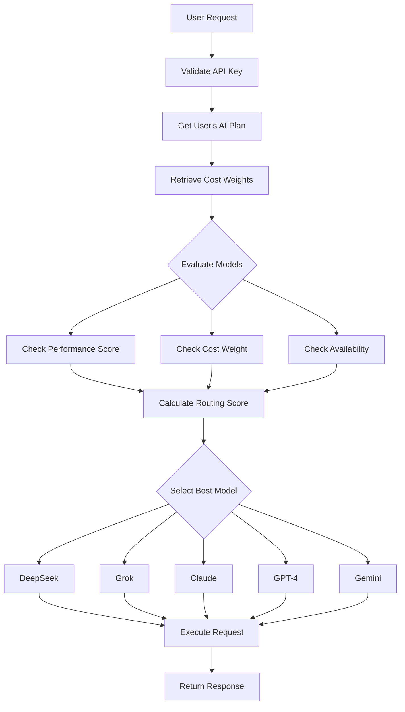

# 🤖 Oropendola AI - Agent Mode API for VS Code Extension

## 🎯 Agent Mode Philosophy

**No model selection required!** Users simply send requests, and Oropendola's intelligent backend automatically:

✅ **Selects the optimal AI model** based on cost weights, performance, and availability  
✅ **Manages cost control** according to the user's AI Plan  
✅ **Routes requests efficiently** across DeepSeek, Grok, Claude, GPT-4, and Gemini  
✅ **Provides seamless experience** - users never need to know which model is used  

---

## Base URL

```
https://oropendola.ai/api/method/oropendola_ai.oropendola_ai.api.vscode_extension.
```

---

## 🚀 Primary Endpoint: Agent Mode

### **`agent`** - Intelligent AI Routing

The main endpoint for all AI interactions. Oropendola automatically selects the best model.

**Endpoint:** `agent`

**Method:** `POST`

**Parameters:**
- `api_key` (string, required): Your API key
- `prompt` (string, required): Your request/question
- `context` (string, optional): Additional context or system instructions
- `temperature` (float, optional): Creativity level (0.0 - 2.0, default: 0.7)
- `max_tokens` (int, optional): Maximum response tokens

**Example:**

```bash
curl -X POST https://oropendola.ai/api/method/oropendola_ai.oropendola_ai.api.vscode_extension.agent \
  -H "Content-Type: application/json" \
  -d '{
    "api_key": "YOUR_API_KEY",
    "prompt": "Explain async/await in JavaScript",
    "temperature": 0.7
  }'
```

**Response:**

```json
{
  "status": 200,
  "model": "Claude",
  "response": {
    "content": "Async/await is a modern JavaScript feature that...",
    "tokens_used": 150
  },
  "latency_ms": 800,
  "total_time_ms": 850,
  "agent_mode": true,
  "auto_selected": true,
  "selection_reason": "Optimized for cost, performance, and availability"
}
```

---

## 🔧 Specialized Code Endpoints

All specialized endpoints use Agent Mode internally - **no model selection needed!**

### 1. **Code Completion**

**Endpoint:** `code_completion`

**Parameters:**
- `api_key` (string, required)
- `code` (string, required): Incomplete code
- `language` (string, required): Programming language
- `context` (string, optional): Additional context

**Example:**

```bash
curl -X POST https://oropendola.ai/api/method/oropendola_ai.oropendola_ai.api.vscode_extension.code_completion \
  -H "Content-Type: application/json" \
  -d '{
    "api_key": "YOUR_API_KEY",
    "code": "function fibonacci(n) {",
    "language": "javascript"
  }'
```

---

### 2. **Code Explanation**

**Endpoint:** `code_explanation`

**Parameters:**
- `api_key` (string, required)
- `code` (string, required): Code to explain
- `language` (string, required): Programming language

**Example:**

```bash
curl -X POST https://oropendola.ai/api/method/oropendola_ai.oropendola_ai.api.vscode_extension.code_explanation \
  -H "Content-Type: application/json" \
  -d '{
    "api_key": "YOUR_API_KEY",
    "code": "const result = await Promise.all(promises);",
    "language": "javascript"
  }'
```

---

### 3. **Code Refactoring**

**Endpoint:** `code_refactor`

**Parameters:**
- `api_key` (string, required)
- `code` (string, required): Code to refactor
- `language` (string, required): Programming language
- `instructions` (string, required): Refactoring instructions

**Example:**

```bash
curl -X POST https://oropendola.ai/api/method/oropendola_ai.oropendola_ai.api.vscode_extension.code_refactor \
  -H "Content-Type: application/json" \
  -d '{
    "api_key": "YOUR_API_KEY",
    "code": "if (x == 1) { return true; } else { return false; }",
    "language": "javascript",
    "instructions": "Simplify this conditional"
  }'
```

---

## 🎛️ How Agent Mode Works

### Intelligent Routing Algorithm



### Selection Factors

Oropendola evaluates:

1. **Cost Weight** - Based on your AI Plan subscription
2. **Performance Score** - Model capacity and capability ratings
3. **Availability** - Model health status and current load
4. **Latency** - Response time optimization
5. **Success Rate** - Historical reliability

### Example Routing Decision

```
User Plan: Pro Plan
Request: "Explain Python decorators"

Evaluation:
├── DeepSeek   → Score: 7.5 (Low cost, good performance)
├── Grok       → Score: 6.8 (Medium cost, realtime capable)
├── Claude     → Score: 8.9 ⭐ SELECTED (Best for explanations)
├── GPT-4      → Score: 7.2 (High cost, excellent but expensive)
└── Gemini     → Score: 7.0 (Medium cost, long context)

Selected: Claude (Optimized for cost, performance, and quality)
```

---

## 📊 Cost Weight Configuration

Cost weights are automatically configured based on your AI Plan:

| Plan | DeepSeek | Grok | Claude | GPT-4 | Gemini |
|------|----------|------|--------|-------|--------|
| **Free** | High ⭐ | Medium | Low | Very Low | Medium |
| **Pro** | High | High | High ⭐ | Medium | High |
| **Enterprise** | High | High | High | High ⭐ | High |

**Higher weight = More likely to be selected**

---

## 🔑 Supporting Endpoints

### **Health Check**

```bash
curl https://oropendola.ai/api/method/oropendola_ai.oropendola_ai.api.vscode_extension.health_check
```

### **Validate API Key**

```bash
curl -X POST https://oropendola.ai/api/method/oropendola_ai.oropendola_ai.api.vscode_extension.validate_api_key \
  -d '{"api_key": "YOUR_API_KEY"}'
```

### **Get Usage Stats**

```bash
curl -X POST https://oropendola.ai/api/method/oropendola_ai.oropendola_ai.api.vscode_extension.get_usage_stats \
  -d '{"api_key": "YOUR_API_KEY"}'
```

---

## 💻 VS Code Extension Integration

### TypeScript Example

```typescript
const OROPENDOLA_API = 'https://oropendola.ai/api/method/oropendola_ai.oropendola_ai.api.vscode_extension';
const API_KEY = vscode.workspace.getConfiguration('oropendola').get('apiKey');

// Simple agent call - no model selection!
async function askOropendola(prompt: string) {
  const response = await fetch(`${OROPENDOLA_API}.agent`, {
    method: 'POST',
    headers: { 'Content-Type': 'application/json' },
    body: JSON.stringify({
      api_key: API_KEY,
      prompt: prompt
    })
  });
  
  const result = await response.json();
  
  if (result.status === 200) {
    console.log(`✓ Response from ${result.model}`);
    console.log(result.response.content);
    console.log(`Selection: ${result.selection_reason}`);
  }
  
  return result;
}

// Usage
askOropendola("How do I implement a binary search tree in Python?");
```

### Code Completion Example

```typescript
async function completeCode(editor: vscode.TextEditor) {
  const document = editor.document;
  const position = editor.selection.active;
  const code = document.getText(new vscode.Range(0, 0, position.line, position.character));
  const language = document.languageId;
  
  const response = await fetch(`${OROPENDOLA_API}.code_completion`, {
    method: 'POST',
    headers: { 'Content-Type': 'application/json' },
    body: JSON.stringify({
      api_key: API_KEY,
      code: code,
      language: language
    })
  });
  
  const result = await response.json();
  return result.response.content;
}
```

---

## ⚡ Best Practices

### ✅ Do's

- **Use `agent` endpoint** for all general queries
- **Trust the routing** - let Oropendola select the model
- **Monitor usage** via `get_usage_stats`
- **Handle errors gracefully** with retry logic
- **Cache responses** when appropriate

### ❌ Don'ts

- **Don't try to select models manually** - defeats the purpose
- **Don't hardcode model names** in your extension
- **Don't bypass cost controls** - respect quotas
- **Don't ignore rate limits**

---

## 🔒 Security & Limits

### Rate Limits
- **Free Plan**: 10 requests/minute
- **Pro Plan**: 60 requests/minute  
- **Enterprise Plan**: 300 requests/minute

### Quota System
Daily quotas are enforced. Check remaining quota:

```typescript
const stats = await getUsageStats(apiKey);
console.log(`Remaining: ${stats.daily_quota_remaining} / ${stats.daily_quota_limit}`);
```

---

## 📈 Response Metadata

Every response includes metadata about model selection:

```json
{
  "status": 200,
  "model": "Claude",              // Which model was selected
  "agent_mode": true,              // Agent mode was used
  "auto_selected": true,           // Model was auto-selected
  "selection_reason": "...",       // Why this model was chosen
  "latency_ms": 800,               // Model response time
  "total_time_ms": 850,            // Total request time
  "response": { ... }              // Actual AI response
}
```

---

## 🎯 Quick Start Checklist

- [ ] Get API key from Oropendola dashboard
- [ ] Test with `health_check` endpoint
- [ ] Validate API key with `validate_api_key`
- [ ] Make first `agent` request
- [ ] Integrate into VS Code extension
- [ ] Monitor usage with `get_usage_stats`
- [ ] Enjoy intelligent routing! 🚀

---

## 🆘 Support

- **Documentation**: https://docs.oropendola.ai
- **Email**: support@oropendola.ai
- **Discord**: https://discord.gg/oropendola-ai

---

**Experience the power of intelligent AI routing with Agent Mode!** 🤖✨
