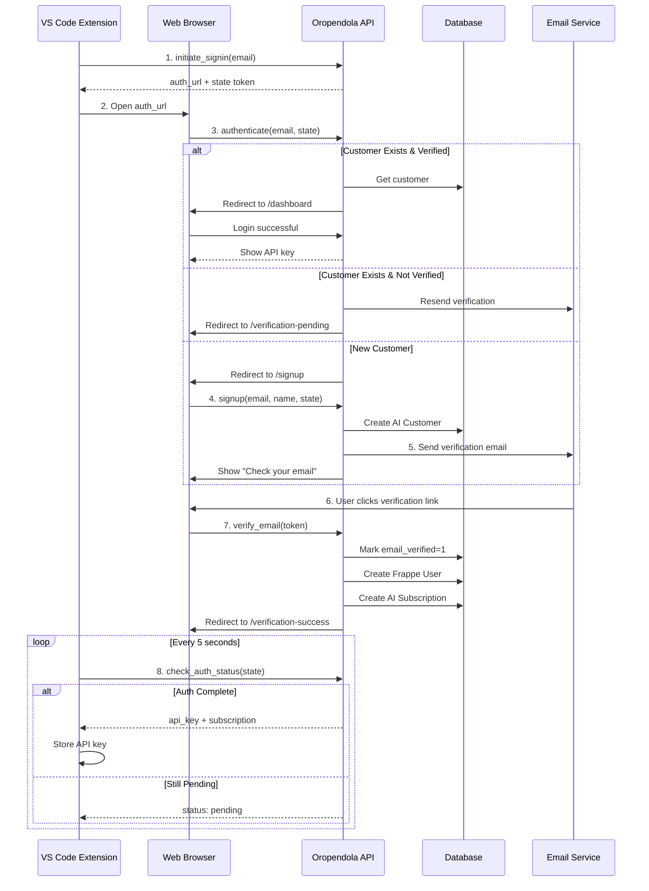

# 🔐 VS Code Extension Authentication Flow

## Overview

Complete OAuth-style authentication flow for the Oropendola AI VS Code extension with email verification, customer account linking, and automatic subscription creation.

---

## 🏗️ Architecture Overview

### **Three-Tier Linking Structure**

```
VS Code Extension
       ↓ (OAuth-style flow)
AI Customer (with email verification)
       ↓ (linked via `user` field)
Frappe User Account
       ↓ (linked via `customer` field)
AI Subscription
       ↓ (contains)
API Key
```

---

## 🔄 Complete Authentication Flow

### **Step-by-Step Process**



---

## 📊 Data Model & Relationships

### **AI Customer** ↔ **Frappe User** ↔ **AI Subscription**

#### **AI Customer Fields**

| Field | Type | Description |
|-------|------|-------------|
| **customer_name** | Data | Customer's full name |
| **email** | Data (Email) | Unique email address |
| **user** | Link (User) | Linked Frappe User account |
| **status** | Select | Active / Inactive / Pending Verification |
| **email_verified** | Check | Email verification status |
| **verification_token** | Data | Hashed verification token |
| **verification_sent_at** | Datetime | When email was sent |
| **verified_at** | Datetime | When email was verified |

**File**: [`ai_customer.json`](file:///home/frappe/frappe-bench/apps/oropendola_ai/oropendola_ai/oropendola_ai/doctype/ai_customer/ai_customer.json)

---

#### **Linking Logic**

**AI Customer → Frappe User**:
```python
# Created after email verification
if not self.user:
    user = frappe.get_doc({
        "doctype": "User",
        "email": self.email,
        "first_name": self.customer_name,
        "enabled": 1,
        "user_type": "Website User"
    })
    user.insert()
    
    self.db_set("user", user.name)
```

**AI Customer → AI Subscription**:
```python
subscription = frappe.get_doc({
    "doctype": "AI Subscription",
    "customer": self.name,  # AI Customer ID
    "plan": plan_id,
    "billing_email": self.email
})
subscription.insert()
```

**AI Subscription → AI Customer** (reverse lookup):
```python
customer = frappe.get_doc("AI Subscription", subscription_id).customer
```

---

## 🔑 API Endpoints

### Base URL
```
https://oropendola.ai/api/method/oropendola_ai.oropendola_ai.api.auth
```

---

### 1. **Initiate Sign-In**

**Endpoint**: `.initiate_signin`

**Method**: POST

**Parameters**:
- `email` (string, required): User's email
- `redirect_uri` (string, optional): Redirect URI after auth

**Response**:
```json
{
  "success": true,
  "auth_url": "https://oropendola.ai/api/method/.../authenticate?email=user@example.com&state=abc123",
  "state": "abc123",
  "message": "Please open the URL in your browser"
}
```

**Usage** (VS Code Extension):
```typescript
const response = await fetch('https://oropendola.ai/api/method/oropendola_ai.oropendola_ai.api.auth.initiate_signin', {
    method: 'POST',
    headers: { 'Content-Type': 'application/json' },
    body: JSON.stringify({ email: userEmail })
});

const { auth_url, state } = await response.json();

// Open browser
vscode.env.openExternal(vscode.Uri.parse(auth_url));

// Start polling
pollAuthStatus(state);
```

---

### 2. **Authenticate** (Browser Endpoint)

**Endpoint**: `.authenticate`

**Method**: GET (redirects)

**Parameters**:
- `email` (string, required): User's email
- `state` (string, optional): State token

**Behavior**:
- **Existing + Verified**: Redirect to `/dashboard` (logged in)
- **Existing + Not Verified**: Resend email → Redirect to `/verification-pending`
- **New User**: Redirect to `/signup`

**This is NOT called directly by VS Code** - browser navigates here.

---

### 3. **Sign Up**

**Endpoint**: `.signup`

**Method**: POST

**Parameters**:
- `email` (string, required): User's email
- `customer_name` (string, required): Customer's name
- `state` (string, optional): State token

**Response**:
```json
{
  "success": true,
  "customer_id": "AIC.25.0001",
  "message": "Account created! Verification email sent to user@example.com",
  "verification_pending": true
}
```

**Actions**:
1. Creates AI Customer record
2. Sets status = "Pending Verification"
3. Automatically sends verification email (in `after_insert`)

---

### 4. **Verify Email** (From Email Link)

**Endpoint**: `.verify_email`

**Method**: GET (redirects)

**Parameters**:
- `token` (string, required): Verification token from email

**Behavior**:
1. Validates token (24-hour expiry)
2. Marks `email_verified = 1`
3. Creates Frappe User account
4. Redirects to `/verification-success`

**Email Contains**:
```html
<a href="https://oropendola.ai/api/method/oropendola_ai.oropendola_ai.api.auth.verify_email?token=abc123def456">
    Verify Email
</a>
```

---

### 5. **Check Auth Status** (Polling)

**Endpoint**: `.check_auth_status`

**Method**: POST

**Parameters**:
- `state` (string, required): State token from initiate_signin

**Response** (Pending):
```json
{
  "success": true,
  "status": "pending",
  "message": "Waiting for signup"
}
```

**Response** (Verification Pending):
```json
{
  "success": true,
  "status": "verification_pending",
  "message": "Waiting for email verification"
}
```

**Response** (Complete):
```json
{
  "success": true,
  "status": "complete",
  "api_key": "your-api-key-here",
  "message": "Authentication complete"
}
```

**Usage** (VS Code Extension):
```typescript
async function pollAuthStatus(state: string) {
    const interval = setInterval(async () => {
        const response = await fetch('https://oropendola.ai/api/method/oropendola_ai.oropendola_ai.api.auth.check_auth_status', {
            method: 'POST',
            headers: { 'Content-Type': 'application/json' },
            body: JSON.stringify({ state })
        });
        
        const data = await response.json();
        
        if (data.status === 'complete') {
            clearInterval(interval);
            storeApiKey(data.api_key);
            vscode.window.showInformationMessage('Signed in successfully!');
        } else if (data.status === 'expired') {
            clearInterval(interval);
            vscode.window.showErrorMessage('Authentication expired. Please try again.');
        } else {
            // Still pending - keep polling
            console.log(data.message);
        }
    }, 5000); // Poll every 5 seconds
}
```

---

### 6. **Resend Verification**

**Endpoint**: `.resend_verification`

**Method**: POST

**Parameters**:
- `email` (string, required): User's email

**Response**:
```json
{
  "success": true,
  "message": "Verification email resent to user@example.com"
}
```

---

### 7. **Get API Key** (Authenticated)

**Endpoint**: `.get_api_key`

**Method**: POST

**Auth**: Required (logged-in user)

**Response**:
```json
{
  "success": true,
  "api_key": "abc123def456",
  "api_key_prefix": "abc123de",
  "subscription_id": "SUB-2025-00001",
  "plan": "free",
  "warning": "API key shown once. Store it securely."
}
```

---

## 📧 Email Verification

### **Verification Email Template**

**Subject**: Verify Your Oropendola AI Account

**Body**:
```html
<h2>Welcome to Oropendola AI!</h2>
<p>Hello {customer_name},</p>
<p>Thank you for signing up. Please verify your email address:</p>
<p>
    <a href="{verification_url}" style="background-color: #4CAF50; color: white; padding: 10px 20px; text-decoration: none; border-radius: 5px;">
        Verify Email
    </a>
</p>
<p>Or copy this link: {verification_url}</p>
<p>This link will expire in 24 hours.</p>
<p>If you didn't create this account, please ignore this email.</p>
```

**Token Security**:
- Generated using `secrets.token_urlsafe(32)`
- Stored as SHA-256 hash
- 24-hour expiry
- Single-use (deleted after verification)

---

## 🎯 Example User Journey

### **Scenario: New User Sign-Up**

**1. User opens VS Code extension**
```
User clicks "Sign In" button
Extension shows input: "Enter your email"
User enters: john@example.com
```

**2. Extension initiates auth**
```typescript
POST /api/method/.../initiate_signin
Body: { email: "john@example.com" }

Response:
{
  auth_url: "https://oropendola.ai/.../authenticate?email=john@example.com&state=xyz789",
  state: "xyz789"
}
```

**3. Extension opens browser**
```
Browser navigates to auth_url
Backend checks: No customer found for john@example.com
Redirects to: /signup?email=john@example.com&state=xyz789
```

**4. User fills signup form**
```html
<form action="/api/method/.../signup" method="POST">
    <input name="email" value="john@example.com" readonly />
    <input name="customer_name" placeholder="Full Name" />
    <input name="state" value="xyz789" hidden />
    <button type="submit">Sign Up</button>
</form>
```

**5. Backend creates customer**
```python
# AI Customer created with status="Pending Verification"
# Email sent automatically with verification link
```

**6. User checks email**
```
Subject: Verify Your Oropendola AI Account

[Verify Email Button]
Link: https://oropendola.ai/.../verify_email?token=abc123...
```

**7. User clicks verification link**
```
Browser navigates to verification link
Backend:
  - Validates token
  - Sets email_verified = 1
  - Creates Frappe User (john@example.com)
  - Creates AI Subscription (free plan)
  - Generates API key
  
Redirects to: /verification-success
```

**8. VS Code extension polls**
```typescript
// Extension has been polling every 5 seconds

Poll #1: { status: "pending" }
Poll #2: { status: "pending" }
Poll #3: { status: "verification_pending" }
Poll #4: { status: "verification_pending" }
Poll #5: {
    status: "complete",
    api_key: "xyz789abc123..."
}

// Extension stores API key
// Shows success message
```

**9. User starts coding**
```
Extension now has API key
All AI features enabled
User can start using code completion, chat, etc.
```

---

## 🔐 Security Considerations

### **State Token (CSRF Protection)**
- Random 32-byte token
- Stored in Redis (5-minute expiry)
- Validates email matches
- Prevents session hijacking

### **Verification Token**
- Random 32-byte token
- Stored as SHA-256 hash
- 24-hour expiry
- Single-use only

### **API Key Security**
- Shown only once (in cache for 5 minutes)
- Stored as SHA-256 hash in database
- Cannot be retrieved after initial display
- Regeneration available via API

---

## 📱 Frontend Pages Needed

### **1. /signup** (New User)
- Email (pre-filled, readonly)
- Customer Name (input)
- Terms & Conditions (checkbox)
- Submit button

### **2. /verification-pending** (Waiting)
- "Check your email" message
- Email address shown
- "Resend verification email" button
- Instructions

### **3. /verification-success** (Success)
- "Email verified!" message
- "You can close this window" message
- Optional: Show API key
- Redirect to dashboard (auto)

### **4. /verification-error** (Error)
- Error message (invalid/expired token)
- "Request new verification email" button
- Support contact link

### **5. /dashboard** (Logged In)
- Show API key (if available in cache)
- Subscription details
- Usage stats
- Settings

---

## 🛠️ Implementation Checklist

### **Backend** ✅
- [x] Enhanced AI Customer DocType with verification fields
- [x] Added customer-user linking methods
- [x] Created authentication API endpoints
- [x] Implemented email verification flow
- [x] Added polling endpoint for VS Code
- [x] Integrated with AI Subscription creation

### **Frontend** ⏳
- [ ] Create `/signup` page
- [ ] Create `/verification-pending` page
- [ ] Create `/verification-success` page
- [ ] Create `/verification-error` page
- [ ] Create `/dashboard` page
- [ ] Add email templates

### **VS Code Extension** ⏳
- [ ] Add "Sign In" button
- [ ] Implement `initiate_signin` call
- [ ] Open browser with auth URL
- [ ] Implement auth status polling
- [ ] Store API key securely
- [ ] Show success/error messages

---

## 📊 Database Schema

### **AI Customer**
```sql
CREATE TABLE `tabAI Customer` (
  `name` varchar(140) PRIMARY KEY,
  `customer_name` varchar(140) NOT NULL,
  `email` varchar(140) NOT NULL UNIQUE,
  `user` varchar(140),  -- Link to User
  `status` varchar(50) DEFAULT 'Pending Verification',
  `email_verified` int(1) DEFAULT 0,
  `verification_token` varchar(255),  -- SHA-256 hash
  `verification_sent_at` datetime,
  `verified_at` datetime,
  KEY `email` (`email`),
  KEY `user` (`user`)
);
```

### **AI Subscription**
```sql
-- Links to AI Customer via `customer` field
SELECT * FROM `tabAI Subscription` WHERE customer = 'AIC.25.0001';
```

---

## ✅ Summary

**Implementation Complete**:
1. ✅ Enhanced AI Customer with user linking
2. ✅ Added email verification system
3. ✅ Created OAuth-style auth flow
4. ✅ Implemented polling mechanism
5. ✅ Integrated with subscriptions
6. ✅ Secure token handling
7. ✅ API endpoints for VS Code
8. ✅ Migration successful

**Next Steps**:
- Frontend pages for web UI
- VS Code extension integration
- Email template customization
- Testing & QA

**Result**: **Complete authentication flow with email verification ready for VS Code extension integration!** 🎉
# 🔐 VS Code Extension Authentication Flow

## Overview

Complete OAuth-style authentication flow for the Oropendola AI VS Code extension with email verification, customer account linking, and automatic subscription creation.

---

## 🏗️ Architecture Overview

### **Three-Tier Linking Structure**

```
VS Code Extension
       ↓ (OAuth-style flow)
AI Customer (with email verification)
       ↓ (linked via `user` field)
Frappe User Account
       ↓ (linked via `customer` field)
AI Subscription
       ↓ (contains)
API Key
```

---

## 🔄 Complete Authentication Flow

### **Step-by-Step Process**


---

## 📊 Data Model & Relationships

### **AI Customer** ↔ **Frappe User** ↔ **AI Subscription**

#### **AI Customer Fields**

| Field | Type | Description |
|-------|------|-------------|
| **customer_name** | Data | Customer's full name |
| **email** | Data (Email) | Unique email address |
| **user** | Link (User) | Linked Frappe User account |
| **status** | Select | Active / Inactive / Pending Verification |
| **email_verified** | Check | Email verification status |
| **verification_token** | Data | Hashed verification token |
| **verification_sent_at** | Datetime | When email was sent |
| **verified_at** | Datetime | When email was verified |

**File**: [`ai_customer.json`](file:///home/frappe/frappe-bench/apps/oropendola_ai/oropendola_ai/oropendola_ai/doctype/ai_customer/ai_customer.json)

---

#### **Linking Logic**

**AI Customer → Frappe User**:
```python
# Created after email verification
if not self.user:
    user = frappe.get_doc({
        "doctype": "User",
        "email": self.email,
        "first_name": self.customer_name,
        "enabled": 1,
        "user_type": "Website User"
    })
    user.insert()
    
    self.db_set("user", user.name)
```

**AI Customer → AI Subscription**:
```python
subscription = frappe.get_doc({
    "doctype": "AI Subscription",
    "customer": self.name,  # AI Customer ID
    "plan": plan_id,
    "billing_email": self.email
})
subscription.insert()
```

**AI Subscription → AI Customer** (reverse lookup):
```python
customer = frappe.get_doc("AI Subscription", subscription_id).customer
```

---

## 🔑 API Endpoints

### Base URL
```
https://oropendola.ai/api/method/oropendola_ai.oropendola_ai.api.auth
```

---

### 1. **Initiate Sign-In**

**Endpoint**: `.initiate_signin`

**Method**: POST

**Parameters**:
- `email` (string, required): User's email
- `redirect_uri` (string, optional): Redirect URI after auth

**Response**:
```json
{
  "success": true,
  "auth_url": "https://oropendola.ai/api/method/.../authenticate?email=user@example.com&state=abc123",
  "state": "abc123",
  "message": "Please open the URL in your browser"
}
```

**Usage** (VS Code Extension):
```typescript
const response = await fetch('https://oropendola.ai/api/method/oropendola_ai.oropendola_ai.api.auth.initiate_signin', {
    method: 'POST',
    headers: { 'Content-Type': 'application/json' },
    body: JSON.stringify({ email: userEmail })
});

const { auth_url, state } = await response.json();

// Open browser
vscode.env.openExternal(vscode.Uri.parse(auth_url));

// Start polling
pollAuthStatus(state);
```

---

### 2. **Authenticate** (Browser Endpoint)

**Endpoint**: `.authenticate`

**Method**: GET (redirects)

**Parameters**:
- `email` (string, required): User's email
- `state` (string, optional): State token

**Behavior**:
- **Existing + Verified**: Redirect to `/dashboard` (logged in)
- **Existing + Not Verified**: Resend email → Redirect to `/verification-pending`
- **New User**: Redirect to `/signup`

**This is NOT called directly by VS Code** - browser navigates here.

---

### 3. **Sign Up**

**Endpoint**: `.signup`

**Method**: POST

**Parameters**:
- `email` (string, required): User's email
- `customer_name` (string, required): Customer's name
- `state` (string, optional): State token

**Response**:
```json
{
  "success": true,
  "customer_id": "AIC.25.0001",
  "message": "Account created! Verification email sent to user@example.com",
  "verification_pending": true
}
```

**Actions**:
1. Creates AI Customer record
2. Sets status = "Pending Verification"
3. Automatically sends verification email (in `after_insert`)

---

### 4. **Verify Email** (From Email Link)

**Endpoint**: `.verify_email`

**Method**: GET (redirects)

**Parameters**:
- `token` (string, required): Verification token from email

**Behavior**:
1. Validates token (24-hour expiry)
2. Marks `email_verified = 1`
3. Creates Frappe User account
4. Redirects to `/verification-success`

**Email Contains**:
```html
<a href="https://oropendola.ai/api/method/oropendola_ai.oropendola_ai.api.auth.verify_email?token=abc123def456">
    Verify Email
</a>
```

---

### 5. **Check Auth Status** (Polling)

**Endpoint**: `.check_auth_status`

**Method**: POST

**Parameters**:
- `state` (string, required): State token from initiate_signin

**Response** (Pending):
```json
{
  "success": true,
  "status": "pending",
  "message": "Waiting for signup"
}
```

**Response** (Verification Pending):
```json
{
  "success": true,
  "status": "verification_pending",
  "message": "Waiting for email verification"
}
```

**Response** (Complete):
```json
{
  "success": true,
  "status": "complete",
  "api_key": "your-api-key-here",
  "message": "Authentication complete"
}
```

**Usage** (VS Code Extension):
```typescript
async function pollAuthStatus(state: string) {
    const interval = setInterval(async () => {
        const response = await fetch('https://oropendola.ai/api/method/oropendola_ai.oropendola_ai.api.auth.check_auth_status', {
            method: 'POST',
            headers: { 'Content-Type': 'application/json' },
            body: JSON.stringify({ state })
        });
        
        const data = await response.json();
        
        if (data.status === 'complete') {
            clearInterval(interval);
            storeApiKey(data.api_key);
            vscode.window.showInformationMessage('Signed in successfully!');
        } else if (data.status === 'expired') {
            clearInterval(interval);
            vscode.window.showErrorMessage('Authentication expired. Please try again.');
        } else {
            // Still pending - keep polling
            console.log(data.message);
        }
    }, 5000); // Poll every 5 seconds
}
```

---

### 6. **Resend Verification**

**Endpoint**: `.resend_verification`

**Method**: POST

**Parameters**:
- `email` (string, required): User's email

**Response**:
```json
{
  "success": true,
  "message": "Verification email resent to user@example.com"
}
```

---

### 7. **Get API Key** (Authenticated)

**Endpoint**: `.get_api_key`

**Method**: POST

**Auth**: Required (logged-in user)

**Response**:
```json
{
  "success": true,
  "api_key": "abc123def456",
  "api_key_prefix": "abc123de",
  "subscription_id": "SUB-2025-00001",
  "plan": "free",
  "warning": "API key shown once. Store it securely."
}
```

---

## 📧 Email Verification

### **Verification Email Template**

**Subject**: Verify Your Oropendola AI Account

**Body**:
```html
<h2>Welcome to Oropendola AI!</h2>
<p>Hello {customer_name},</p>
<p>Thank you for signing up. Please verify your email address:</p>
<p>
    <a href="{verification_url}" style="background-color: #4CAF50; color: white; padding: 10px 20px; text-decoration: none; border-radius: 5px;">
        Verify Email
    </a>
</p>
<p>Or copy this link: {verification_url}</p>
<p>This link will expire in 24 hours.</p>
<p>If you didn't create this account, please ignore this email.</p>
```

**Token Security**:
- Generated using `secrets.token_urlsafe(32)`
- Stored as SHA-256 hash
- 24-hour expiry
- Single-use (deleted after verification)

---

## 🎯 Example User Journey

### **Scenario: New User Sign-Up**

**1. User opens VS Code extension**
```
User clicks "Sign In" button
Extension shows input: "Enter your email"
User enters: john@example.com
```

**2. Extension initiates auth**
```typescript
POST /api/method/.../initiate_signin
Body: { email: "john@example.com" }

Response:
{
  auth_url: "https://oropendola.ai/.../authenticate?email=john@example.com&state=xyz789",
  state: "xyz789"
}
```

**3. Extension opens browser**
```
Browser navigates to auth_url
Backend checks: No customer found for john@example.com
Redirects to: /signup?email=john@example.com&state=xyz789
```

**4. User fills signup form**
```html
<form action="/api/method/.../signup" method="POST">
    <input name="email" value="john@example.com" readonly />
    <input name="customer_name" placeholder="Full Name" />
    <input name="state" value="xyz789" hidden />
    <button type="submit">Sign Up</button>
</form>
```

**5. Backend creates customer**
```python
# AI Customer created with status="Pending Verification"
# Email sent automatically with verification link
```

**6. User checks email**
```
Subject: Verify Your Oropendola AI Account

[Verify Email Button]
Link: https://oropendola.ai/.../verify_email?token=abc123...
```

**7. User clicks verification link**
```
Browser navigates to verification link
Backend:
  - Validates token
  - Sets email_verified = 1
  - Creates Frappe User (john@example.com)
  - Creates AI Subscription (free plan)
  - Generates API key
  
Redirects to: /verification-success
```

**8. VS Code extension polls**
```typescript
// Extension has been polling every 5 seconds

Poll #1: { status: "pending" }
Poll #2: { status: "pending" }
Poll #3: { status: "verification_pending" }
Poll #4: { status: "verification_pending" }
Poll #5: {
    status: "complete",
    api_key: "xyz789abc123..."
}

// Extension stores API key
// Shows success message
```

**9. User starts coding**
```
Extension now has API key
All AI features enabled
User can start using code completion, chat, etc.
```

---

## 🔐 Security Considerations

### **State Token (CSRF Protection)**
- Random 32-byte token
- Stored in Redis (5-minute expiry)
- Validates email matches
- Prevents session hijacking

### **Verification Token**
- Random 32-byte token
- Stored as SHA-256 hash
- 24-hour expiry
- Single-use only

### **API Key Security**
- Shown only once (in cache for 5 minutes)
- Stored as SHA-256 hash in database
- Cannot be retrieved after initial display
- Regeneration available via API

---

## 📱 Frontend Pages Needed

### **1. /signup** (New User)
- Email (pre-filled, readonly)
- Customer Name (input)
- Terms & Conditions (checkbox)
- Submit button

### **2. /verification-pending** (Waiting)
- "Check your email" message
- Email address shown
- "Resend verification email" button
- Instructions

### **3. /verification-success** (Success)
- "Email verified!" message
- "You can close this window" message
- Optional: Show API key
- Redirect to dashboard (auto)

### **4. /verification-error** (Error)
- Error message (invalid/expired token)
- "Request new verification email" button
- Support contact link

### **5. /dashboard** (Logged In)
- Show API key (if available in cache)
- Subscription details
- Usage stats
- Settings

---

## 🛠️ Implementation Checklist

### **Backend** ✅
- [x] Enhanced AI Customer DocType with verification fields
- [x] Added customer-user linking methods
- [x] Created authentication API endpoints
- [x] Implemented email verification flow
- [x] Added polling endpoint for VS Code
- [x] Integrated with AI Subscription creation

### **Frontend** ⏳
- [ ] Create `/signup` page
- [ ] Create `/verification-pending` page
- [ ] Create `/verification-success` page
- [ ] Create `/verification-error` page
- [ ] Create `/dashboard` page
- [ ] Add email templates

### **VS Code Extension** ⏳
- [ ] Add "Sign In" button
- [ ] Implement `initiate_signin` call
- [ ] Open browser with auth URL
- [ ] Implement auth status polling
- [ ] Store API key securely
- [ ] Show success/error messages

---

## 📊 Database Schema

### **AI Customer**
```sql
CREATE TABLE `tabAI Customer` (
  `name` varchar(140) PRIMARY KEY,
  `customer_name` varchar(140) NOT NULL,
  `email` varchar(140) NOT NULL UNIQUE,
  `user` varchar(140),  -- Link to User
  `status` varchar(50) DEFAULT 'Pending Verification',
  `email_verified` int(1) DEFAULT 0,
  `verification_token` varchar(255),  -- SHA-256 hash
  `verification_sent_at` datetime,
  `verified_at` datetime,
  KEY `email` (`email`),
  KEY `user` (`user`)
);
```

### **AI Subscription**
```sql
-- Links to AI Customer via `customer` field
SELECT * FROM `tabAI Subscription` WHERE customer = 'AIC.25.0001';
```

---

## ✅ Summary

**Implementation Complete**:
1. ✅ Enhanced AI Customer with user linking
2. ✅ Added email verification system
3. ✅ Created OAuth-style auth flow
4. ✅ Implemented polling mechanism
5. ✅ Integrated with subscriptions
6. ✅ Secure token handling
7. ✅ API endpoints for VS Code
8. ✅ Migration successful

**Next Steps**:
- Frontend pages for web UI
- VS Code extension integration
- Email template customization
- Testing & QA

**Result**: **Complete authentication flow with email verification ready for VS Code extension integration!** 🎉
