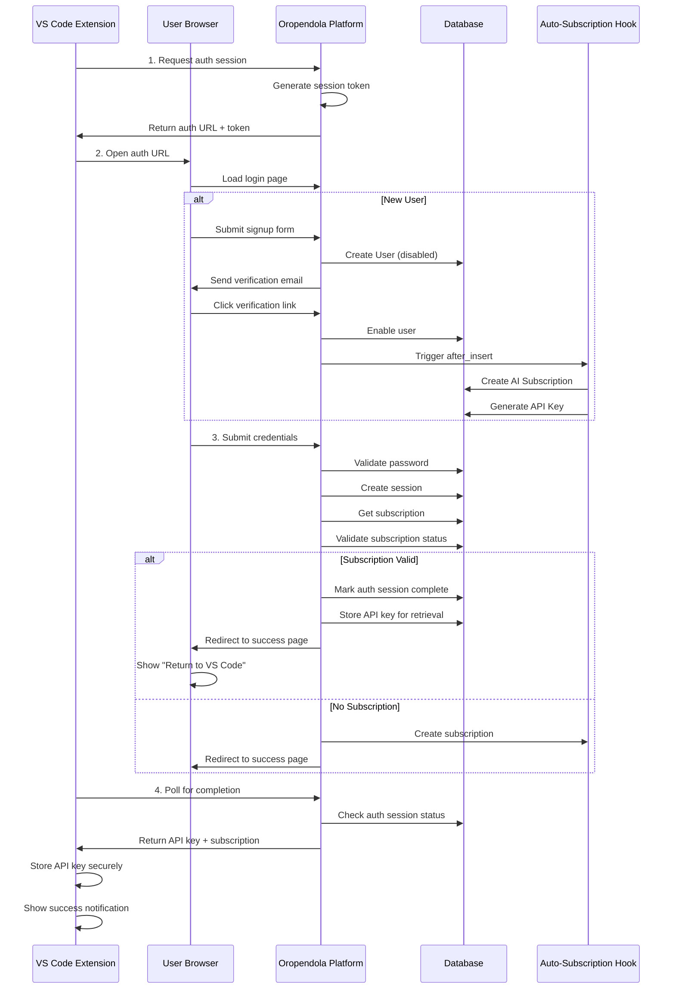

# 🔐 VS Code Extension Authentication Flow

Complete guide for implementing seamless authentication between VS Code extension and Oropendola AI platform.

---

## 🎯 Overview

This document explains the **OAuth-style authentication flow** for VS Code extensions, including:
- Device code flow (recommended for desktop apps)
- Sign-in completion handling
- Subscription validation
- Automatic redirection back to VS Code
- Error handling

---

## 🔄 Complete Authentication Flow



---

## 🛠️ Implementation

### **Step 1: Create Authentication Session API**

Create a new API endpoint for VS Code to initiate authentication:

**File**: `oropendola_ai/oropendola_ai/api/vscode_extension.py`

```python
@frappe.whitelist(allow_guest=True)
def initiate_vscode_auth():
    """
    Initiate authentication flow for VS Code extension.
    Returns auth URL and session token for polling.
    """
    import secrets
    import frappe
    
    # Generate unique session token
    session_token = secrets.token_urlsafe(32)
    
    # Store session in cache (10 minutes expiry)
    cache_key = f"vscode_auth:{session_token}"
    frappe.cache().set_value(cache_key, {
        "status": "pending",
        "created_at": frappe.utils.now(),
        "user": None,
        "api_key": None
    }, expires_in_sec=600)
    
    # Build auth URL
    auth_url = f"{frappe.utils.get_url()}/vscode-auth?token={session_token}"
    
    return {
        "success": True,
        "auth_url": auth_url,
        "session_token": session_token,
        "expires_in": 600,
        "message": "Open this URL in your browser to complete sign-in"
    }


@frappe.whitelist(allow_guest=True)
def check_vscode_auth_status(session_token):
    """
    Check if VS Code authentication is complete.
    Called by extension for polling.
    """
    import frappe
    
    cache_key = f"vscode_auth:{session_token}"
    session_data = frappe.cache().get_value(cache_key)
    
    if not session_data:
        return {
            "success": False,
            "status": "expired",
            "message": "Authentication session expired. Please try again."
        }
    
    if session_data.get("status") == "complete":
        # Clear cache after successful retrieval
        frappe.cache().delete_value(cache_key)
        
        return {
            "success": True,
            "status": "complete",
            "api_key": session_data.get("api_key"),
            "user_email": session_data.get("user"),
            "subscription": session_data.get("subscription"),
            "message": "Authentication successful!"
        }
    
    return {
        "success": True,
        "status": session_data.get("status"),
        "message": "Waiting for user to complete sign-in..."
    }
```

---

### **Step 2: Create Custom Login Page for VS Code**

**File**: `oropendola_ai/www/vscode-auth/index.html`

```html
<!DOCTYPE html>
<html>
<head>
    <meta charset="utf-8">
    <meta name="viewport" content="width=device-width, initial-scale=1.0">
    <title>VS Code Authentication - Oropendola AI</title>
    <style>
        * {
            margin: 0;
            padding: 0;
            box-sizing: border-box;
        }
        
        body {
            font-family: -apple-system, BlinkMacSystemFont, 'Segoe UI', Roboto, sans-serif;
            background: linear-gradient(135deg, #667eea 0%, #764ba2 100%);
            min-height: 100vh;
            display: flex;
            align-items: center;
            justify-content: center;
            padding: 20px;
        }
        
        .container {
            background: white;
            border-radius: 12px;
            box-shadow: 0 20px 60px rgba(0,0,0,0.3);
            max-width: 450px;
            width: 100%;
            padding: 40px;
        }
        
        .logo {
            text-align: center;
            margin-bottom: 30px;
        }
        
        .logo h1 {
            color: #667eea;
            font-size: 28px;
            margin-bottom: 10px;
        }
        
        .logo p {
            color: #666;
            font-size: 14px;
        }
        
        .status {
            text-align: center;
            padding: 20px;
            background: #f8f9fa;
            border-radius: 8px;
            margin-bottom: 20px;
        }
        
        .status.loading {
            color: #667eea;
        }
        
        .status.success {
            background: #d4edda;
            color: #155724;
        }
        
        .status.error {
            background: #f8d7da;
            color: #721c24;
        }
        
        .spinner {
            border: 3px solid #f3f3f3;
            border-top: 3px solid #667eea;
            border-radius: 50%;
            width: 40px;
            height: 40px;
            animation: spin 1s linear infinite;
            margin: 20px auto;
        }
        
        @keyframes spin {
            0% { transform: rotate(0deg); }
            100% { transform: rotate(360deg); }
        }
        
        .btn {
            display: block;
            width: 100%;
            padding: 14px;
            background: #667eea;
            color: white;
            border: none;
            border-radius: 6px;
            font-size: 16px;
            font-weight: 600;
            cursor: pointer;
            transition: background 0.3s;
        }
        
        .btn:hover {
            background: #5568d3;
        }
        
        .btn:disabled {
            background: #ccc;
            cursor: not-allowed;
        }
        
        .info {
            margin-top: 20px;
            padding: 15px;
            background: #e7f3ff;
            border-left: 4px solid #667eea;
            border-radius: 4px;
            font-size: 14px;
            color: #333;
        }
        
        .success-icon {
            font-size: 64px;
            color: #28a745;
            margin-bottom: 20px;
        }
    </style>
</head>
<body>
    <div class="container">
        <div class="logo">
            <h1>🤖 Oropendola AI</h1>
            <p>VS Code Extension Authentication</p>
        </div>
        
        <div id="content">
            <div class="status loading">
                <div class="spinner"></div>
                <p>Checking your authentication status...</p>
            </div>
        </div>
    </div>
    
    <script>
        const urlParams = new URLSearchParams(window.location.search);
        const sessionToken = urlParams.get('token');
        const content = document.getElementById('content');
        
        if (!sessionToken) {
            content.innerHTML = `
                <div class="status error">
                    <p>❌ Invalid authentication link</p>
                </div>
                <div class="info">
                    Please use the authentication link provided by VS Code.
                </div>
            `;
        } else {
            checkAuthStatus();
        }
        
        async function checkAuthStatus() {
            try {
                // Check if user is already logged in
                const userResponse = await fetch('/api/method/frappe.auth.get_logged_user', {
                    credentials: 'include'
                });
                
                const userData = await userResponse.json();
                
                if (userData.message && userData.message !== 'Guest') {
                    // User is logged in - complete auth flow
                    await completeAuth(userData.message);
                } else {
                    // User not logged in - redirect to login
                    redirectToLogin();
                }
            } catch (error) {
                console.error('Auth check error:', error);
                showError('Failed to check authentication status');
            }
        }
        
        function redirectToLogin() {
            content.innerHTML = `
                <div class="status">
                    <p>Please sign in to continue</p>
                </div>
                <button class="btn" onclick="goToLogin()">
                    Sign In with Oropendola AI
                </button>
                <div class="info">
                    <strong>New user?</strong> You'll be able to sign up on the next page.
                </div>
            `;
        }
        
        function goToLogin() {
            // Save session token for after login
            sessionStorage.setItem('vscode_auth_token', sessionToken);
            
            // Redirect to login page
            window.location.href = '/login#login';
        }
        
        async function completeAuth(userEmail) {
            content.innerHTML = `
                <div class="status loading">
                    <div class="spinner"></div>
                    <p>Completing authentication...</p>
                </div>
            `;
            
            try {
                // Get user's API key and subscription
                const apiKeyResponse = await fetch(
                    '/api/method/oropendola_ai.oropendola_ai.api.user_api.get_my_api_key',
                    {
                        method: 'POST',
                        credentials: 'include'
                    }
                );
                
                const apiKeyData = await apiKeyResponse.json();
                
                const subscriptionResponse = await fetch(
                    '/api/method/oropendola_ai.oropendola_ai.api.user_api.get_my_subscription',
                    {
                        method: 'POST',
                        credentials: 'include'
                    }
                );
                
                const subscriptionData = await subscriptionResponse.json();
                
                if (!apiKeyData.message.success) {
                    throw new Error(apiKeyData.message.error || 'Failed to get API key');
                }
                
                if (!subscriptionData.message.success) {
                    throw new Error(subscriptionData.message.error || 'Failed to get subscription');
                }
                
                // Mark auth session as complete
                await markAuthComplete(
                    userEmail,
                    apiKeyData.message.api_key,
                    subscriptionData.message.subscription
                );
                
                showSuccess();
                
            } catch (error) {
                console.error('Complete auth error:', error);
                showError(error.message);
            }
        }
        
        async function markAuthComplete(userEmail, apiKey, subscription) {
            const response = await fetch(
                '/api/method/oropendola_ai.oropendola_ai.api.vscode_extension.complete_vscode_auth',
                {
                    method: 'POST',
                    headers: {
                        'Content-Type': 'application/json'
                    },
                    credentials: 'include',
                    body: JSON.stringify({
                        session_token: sessionToken,
                        user_email: userEmail,
                        api_key: apiKey,
                        subscription: subscription
                    })
                }
            );
            
            const data = await response.json();
            
            if (!data.message.success) {
                throw new Error(data.message.error || 'Failed to complete auth');
            }
        }
        
        function showSuccess() {
            content.innerHTML = `
                <div class="status success">
                    <div class="success-icon">✓</div>
                    <h2>Authentication Successful!</h2>
                    <p style="margin-top: 10px;">You can now return to VS Code</p>
                </div>
                <div class="info">
                    <strong>✓ Subscription Active</strong><br>
                    <strong>✓ API Key Retrieved</strong><br>
                    <strong>✓ Ready to Use</strong>
                </div>
                <button class="btn" onclick="window.close()">
                    Close This Window
                </button>
            `;
            
            // Auto-close after 3 seconds
            setTimeout(() => {
                window.close();
            }, 3000);
        }
        
        function showError(message) {
            content.innerHTML = `
                <div class="status error">
                    <p>❌ ${message}</p>
                </div>
                <button class="btn" onclick="location.reload()">
                    Try Again
                </button>
            `;
        }
    </script>
</body>
</html>
```

**File**: `oropendola_ai/www/vscode-auth/index.py`

```python
import frappe

def get_context(context):
    """Set context for VS Code auth page"""
    context.no_cache = 1
    return context
```

---

### **Step 3: Add Completion Handler API**

**File**: `oropendola_ai/oropendola_ai/api/vscode_extension.py` (add to existing file)

```python
@frappe.whitelist()
def complete_vscode_auth(session_token, user_email, api_key, subscription):
    """
    Mark VS Code authentication as complete.
    Called by the auth page after successful login.
    """
    import frappe
    
    cache_key = f"vscode_auth:{session_token}"
    session_data = frappe.cache().get_value(cache_key)
    
    if not session_data:
        return {
            "success": False,
            "error": "Invalid or expired session"
        }
    
    # Update session data
    frappe.cache().set_value(cache_key, {
        "status": "complete",
        "user": user_email,
        "api_key": api_key,
        "subscription": subscription,
        "completed_at": frappe.utils.now()
    }, expires_in_sec=300)  # 5 minutes to retrieve
    
    return {
        "success": True,
        "message": "Authentication completed successfully"
    }
```

---

### **Step 4: Handle Post-Login Redirect**

**File**: `oropendola_ai/www/login-redirect/index.html`

```html
<!DOCTYPE html>
<html>
<head>
    <meta charset="utf-8">
    <title>Redirecting...</title>
</head>
<body>
    <script>
        // Check if this is from VS Code auth
        const vscodeToken = sessionStorage.getItem('vscode_auth_token');
        
        if (vscodeToken) {
            // Clear the token
            sessionStorage.removeItem('vscode_auth_token');
            
            // Redirect back to VS Code auth page
            window.location.href = `/vscode-auth?token=${vscodeToken}`;
        } else {
            // Normal login - redirect to dashboard
            window.location.href = '/app';
        }
    </script>
</body>
</html>
```

---

### **Step 5: Update Frappe Login Redirect**

Configure Frappe to redirect to our handler after login.

**File**: `oropendola_ai/hooks.py`

```python
# Add to existing hooks.py

# Custom redirect after login
after_login = "oropendola_ai.oropendola_ai.auth_hooks.after_login_handler"
```

**File**: `oropendola_ai/oropendola_ai/auth_hooks.py` (create new)

```python
import frappe

def after_login_handler(login_manager):
    """
    Custom handler after successful login.
    Redirects to VS Code auth if session token exists.
    """
    # Check if this is a VS Code auth flow
    # (The frontend will handle this via JavaScript)
    pass
```

---

## 🖥️ VS Code Extension Integration

### **TypeScript/JavaScript Code**

```typescript
import * as vscode from 'vscode';
import * as open from 'open';

class OropendolaAuth {
    private static readonly API_BASE = 'https://oropendola.ai/api/method/oropendola_ai.oropendola_ai.api.vscode_extension';
    private sessionToken: string | null = null;
    private pollingInterval: NodeJS.Timer | null = null;

    async signIn(): Promise<AuthResult> {
        try {
            // Step 1: Initiate auth session
            const session = await this.initiateAuth();
            this.sessionToken = session.session_token;

            // Step 2: Open browser for user to sign in
            vscode.window.showInformationMessage(
                'Opening browser for Oropendola AI sign-in...',
                'Cancel'
            );
            
            await open(session.auth_url);

            // Step 3: Poll for completion
            const result = await this.pollForCompletion();

            // Step 4: Store API key securely
            await this.storeCredentials(result);

            vscode.window.showInformationMessage(
                '✓ Successfully signed in to Oropendola AI!'
            );

            return result;

        } catch (error) {
            vscode.window.showErrorMessage(
                `Sign-in failed: ${error.message}`
            );
            throw error;
        } finally {
            this.cleanup();
        }
    }

    private async initiateAuth(): Promise<AuthSession> {
        const response = await fetch(`${OropendolaAuth.API_BASE}.initiate_vscode_auth`, {
            method: 'POST'
        });

        const data = await response.json();

        if (!data.message.success) {
            throw new Error(data.message.error || 'Failed to initiate authentication');
        }

        return data.message;
    }

    private pollForCompletion(): Promise<AuthResult> {
        return new Promise((resolve, reject) => {
            let attempts = 0;
            const maxAttempts = 120; // 10 minutes (5s interval)

            this.pollingInterval = setInterval(async () => {
                attempts++;

                if (attempts > maxAttempts) {
                    this.cleanup();
                    reject(new Error('Authentication timeout'));
                    return;
                }

                try {
                    const response = await fetch(
                        `${OropendolaAuth.API_BASE}.check_vscode_auth_status`,
                        {
                            method: 'POST',
                            headers: {
                                'Content-Type': 'application/json'
                            },
                            body: JSON.stringify({
                                session_token: this.sessionToken
                            })
                        }
                    );

                    const data = await response.json();

                    if (data.message.status === 'complete') {
                        this.cleanup();
                        resolve({
                            apiKey: data.message.api_key,
                            userEmail: data.message.user_email,
                            subscription: data.message.subscription
                        });
                    } else if (data.message.status === 'expired') {
                        this.cleanup();
                        reject(new Error('Authentication session expired'));
                    }
                    // else status is 'pending' - continue polling

                } catch (error) {
                    console.error('Polling error:', error);
                }
            }, 5000); // Poll every 5 seconds
        });
    }

    private async storeCredentials(result: AuthResult): Promise<void> {
        const context = vscode.workspace.getConfiguration('oropendola');
        
        // Store in VS Code secret storage
        await context.update('apiKey', result.apiKey, true);
        await context.update('userEmail', result.userEmail, true);
        
        // Store subscription info
        await context.update('subscription', result.subscription, false);
    }

    private cleanup(): void {
        if (this.pollingInterval) {
            clearInterval(this.pollingInterval);
            this.pollingInterval = null;
        }
        this.sessionToken = null;
    }
}

// Usage in extension
export function activate(context: vscode.ExtensionContext) {
    const auth = new OropendolaAuth();

    let disposable = vscode.commands.registerCommand(
        'oropendola.signIn',
        async () => {
            try {
                await auth.signIn();
            } catch (error) {
                console.error('Sign-in error:', error);
            }
        }
    );

    context.subscriptions.push(disposable);
}

interface AuthSession {
    success: boolean;
    auth_url: string;
    session_token: string;
    expires_in: number;
}

interface AuthResult {
    apiKey: string;
    userEmail: string;
    subscription: any;
}
```

---

## 📊 Complete Flow Diagram

```
┌─────────────────┐
│  VS Code Ext    │
│  User clicks    │
│  "Sign In"      │
└────────┬────────┘
         │
         │ 1. Request auth session
         ↓
┌─────────────────────────────────┐
│  POST /initiate_vscode_auth     │
│  Returns: {                     │
│    auth_url,                    │
│    session_token                │
│  }                              │
└────────┬────────────────────────┘
         │
         │ 2. Open browser
         ↓
┌──────────────────────────────────┐
│  Browser → /vscode-auth?token=   │
│  - Check if user logged in       │
│  - If not: redirect to /login    │
│  - If yes: complete auth         │
└────────┬─────────────────────────┘
         │
         │ 3a. User not logged in
         ↓
┌──────────────────────────────────┐
│  /login#login                    │
│  - User enters credentials       │
│  - Frappe validates              │
│  - Session created               │
│  - JS checks for vscode token    │
│  - Redirects back to /vscode-auth│
└────────┬─────────────────────────┘
         │
         │ 3b. Complete auth
         ↓
┌──────────────────────────────────┐
│  JavaScript on /vscode-auth:     │
│  1. Get API key                  │
│  2. Get subscription             │
│  3. Call complete_vscode_auth    │
│  4. Update cache with data       │
│  5. Show success message         │
└────────┬─────────────────────────┘
         │
         │ 4. VS Code polling
         ↓
┌──────────────────────────────────┐
│  POST /check_vscode_auth_status  │
│  - Check cache for session token │
│  - If complete: return API key   │
│  - If pending: return status     │
│  - If expired: return error      │
└────────┬─────────────────────────┘
         │
         │ 5. Auth complete
         ↓
┌──────────────────────────────────┐
│  VS Code Extension:              │
│  - Store API key securely        │
│  - Store user info               │
│  - Show success notification     │
│  - Enable AI features            │
└──────────────────────────────────┘
```

---

## 🔒 Security Considerations

### **1. Session Token Security**

```python
# Generate cryptographically secure tokens
session_token = secrets.token_urlsafe(32)  # 256-bit entropy

# Short expiry (10 minutes)
expires_in_sec=600

# Single-use tokens
# Clear cache after successful retrieval
frappe.cache().delete_value(cache_key)
```

### **2. API Key Handling**

```python
# Cache API key for limited time (5 minutes)
expires_in_sec=300

# Only return once
if session_data.get("status") == "complete":
    frappe.cache().delete_value(cache_key)
    return api_key
```

### **3. CORS Configuration**

Ensure VS Code auth endpoints allow cross-origin requests from localhost during development.

---

## ⚠️ Error Handling

### **Common Scenarios**

| Scenario | Handling |
|----------|----------|
| User closes browser | VS Code polls timeout after 10 min, show retry option |
| Session expires | Return error status, prompt user to restart |
| No subscription | Auto-create subscription via hook, continue flow |
| API key not available | Show error, direct to dashboard to retrieve |
| Network error | Retry with exponential backoff |

---

## 🧪 Testing

### **Manual Test Flow**

1. **Start**: Click "Sign In" in VS Code
2. **Browser Opens**: Should show `/vscode-auth?token=...`
3. **Not Logged In**: Redirects to `/login#login`
4. **Enter Credentials**: Submit login form
5. **Post-Login**: JavaScript redirects to `/vscode-auth`
6. **Completion**: API key retrieved, success shown
7. **VS Code**: Receives API key, shows success

### **Test Commands**

```bash
# Test auth initiation
curl -X POST https://oropendola.ai/api/method/oropendola_ai.oropendola_ai.api.vscode_extension.initiate_vscode_auth

# Test status check
curl -X POST https://oropendola.ai/api/method/oropendola_ai.oropendola_ai.api.vscode_extension.check_vscode_auth_status \
  -H "Content-Type: application/json" \
  -d '{"session_token": "your-token-here"}'
```

---

## 📚 Related Documentation

- [User Sign-In Workflow](./USER_SIGNIN_WORKFLOW.md)
- [Frontend Integration Guide](./FRONTEND_INTEGRATION_GUIDE.md)
- [VS Code Extension API](./VSCODE_EXTENSION_API.md)
- [Authentication Flow Visual](./AUTHENTICATION_FLOW_VISUAL.md)

---

## ✅ Implementation Checklist

- [ ] Create `initiate_vscode_auth` API endpoint
- [ ] Create `check_vscode_auth_status` API endpoint
- [ ] Create `complete_vscode_auth` API endpoint
- [ ] Create `/vscode-auth` web page
- [ ] Add session token storage in JavaScript
- [ ] Update VS Code extension with polling logic
- [ ] Test complete flow end-to-end
- [ ] Handle error scenarios
- [ ] Add logging for debugging
- [ ] Document for users

---

**This flow provides a seamless, secure authentication experience for VS Code users!** 🚀
# 🔐 VS Code Extension Authentication Flow

Complete guide for implementing seamless authentication between VS Code extension and Oropendola AI platform.

---

## 🎯 Overview

This document explains the **OAuth-style authentication flow** for VS Code extensions, including:
- Device code flow (recommended for desktop apps)
- Sign-in completion handling
- Subscription validation
- Automatic redirection back to VS Code
- Error handling

---

## 🔄 Complete Authentication Flow


---

## 🛠️ Implementation

### **Step 1: Create Authentication Session API**

Create a new API endpoint for VS Code to initiate authentication:

**File**: `oropendola_ai/oropendola_ai/api/vscode_extension.py`

```python
@frappe.whitelist(allow_guest=True)
def initiate_vscode_auth():
    """
    Initiate authentication flow for VS Code extension.
    Returns auth URL and session token for polling.
    """
    import secrets
    import frappe
    
    # Generate unique session token
    session_token = secrets.token_urlsafe(32)
    
    # Store session in cache (10 minutes expiry)
    cache_key = f"vscode_auth:{session_token}"
    frappe.cache().set_value(cache_key, {
        "status": "pending",
        "created_at": frappe.utils.now(),
        "user": None,
        "api_key": None
    }, expires_in_sec=600)
    
    # Build auth URL
    auth_url = f"{frappe.utils.get_url()}/vscode-auth?token={session_token}"
    
    return {
        "success": True,
        "auth_url": auth_url,
        "session_token": session_token,
        "expires_in": 600,
        "message": "Open this URL in your browser to complete sign-in"
    }


@frappe.whitelist(allow_guest=True)
def check_vscode_auth_status(session_token):
    """
    Check if VS Code authentication is complete.
    Called by extension for polling.
    """
    import frappe
    
    cache_key = f"vscode_auth:{session_token}"
    session_data = frappe.cache().get_value(cache_key)
    
    if not session_data:
        return {
            "success": False,
            "status": "expired",
            "message": "Authentication session expired. Please try again."
        }
    
    if session_data.get("status") == "complete":
        # Clear cache after successful retrieval
        frappe.cache().delete_value(cache_key)
        
        return {
            "success": True,
            "status": "complete",
            "api_key": session_data.get("api_key"),
            "user_email": session_data.get("user"),
            "subscription": session_data.get("subscription"),
            "message": "Authentication successful!"
        }
    
    return {
        "success": True,
        "status": session_data.get("status"),
        "message": "Waiting for user to complete sign-in..."
    }
```

---

### **Step 2: Create Custom Login Page for VS Code**

**File**: `oropendola_ai/www/vscode-auth/index.html`

```html
<!DOCTYPE html>
<html>
<head>
    <meta charset="utf-8">
    <meta name="viewport" content="width=device-width, initial-scale=1.0">
    <title>VS Code Authentication - Oropendola AI</title>
    <style>
        * {
            margin: 0;
            padding: 0;
            box-sizing: border-box;
        }
        
        body {
            font-family: -apple-system, BlinkMacSystemFont, 'Segoe UI', Roboto, sans-serif;
            background: linear-gradient(135deg, #667eea 0%, #764ba2 100%);
            min-height: 100vh;
            display: flex;
            align-items: center;
            justify-content: center;
            padding: 20px;
        }
        
        .container {
            background: white;
            border-radius: 12px;
            box-shadow: 0 20px 60px rgba(0,0,0,0.3);
            max-width: 450px;
            width: 100%;
            padding: 40px;
        }
        
        .logo {
            text-align: center;
            margin-bottom: 30px;
        }
        
        .logo h1 {
            color: #667eea;
            font-size: 28px;
            margin-bottom: 10px;
        }
        
        .logo p {
            color: #666;
            font-size: 14px;
        }
        
        .status {
            text-align: center;
            padding: 20px;
            background: #f8f9fa;
            border-radius: 8px;
            margin-bottom: 20px;
        }
        
        .status.loading {
            color: #667eea;
        }
        
        .status.success {
            background: #d4edda;
            color: #155724;
        }
        
        .status.error {
            background: #f8d7da;
            color: #721c24;
        }
        
        .spinner {
            border: 3px solid #f3f3f3;
            border-top: 3px solid #667eea;
            border-radius: 50%;
            width: 40px;
            height: 40px;
            animation: spin 1s linear infinite;
            margin: 20px auto;
        }
        
        @keyframes spin {
            0% { transform: rotate(0deg); }
            100% { transform: rotate(360deg); }
        }
        
        .btn {
            display: block;
            width: 100%;
            padding: 14px;
            background: #667eea;
            color: white;
            border: none;
            border-radius: 6px;
            font-size: 16px;
            font-weight: 600;
            cursor: pointer;
            transition: background 0.3s;
        }
        
        .btn:hover {
            background: #5568d3;
        }
        
        .btn:disabled {
            background: #ccc;
            cursor: not-allowed;
        }
        
        .info {
            margin-top: 20px;
            padding: 15px;
            background: #e7f3ff;
            border-left: 4px solid #667eea;
            border-radius: 4px;
            font-size: 14px;
            color: #333;
        }
        
        .success-icon {
            font-size: 64px;
            color: #28a745;
            margin-bottom: 20px;
        }
    </style>
</head>
<body>
    <div class="container">
        <div class="logo">
            <h1>🤖 Oropendola AI</h1>
            <p>VS Code Extension Authentication</p>
        </div>
        
        <div id="content">
            <div class="status loading">
                <div class="spinner"></div>
                <p>Checking your authentication status...</p>
            </div>
        </div>
    </div>
    
    <script>
        const urlParams = new URLSearchParams(window.location.search);
        const sessionToken = urlParams.get('token');
        const content = document.getElementById('content');
        
        if (!sessionToken) {
            content.innerHTML = `
                <div class="status error">
                    <p>❌ Invalid authentication link</p>
                </div>
                <div class="info">
                    Please use the authentication link provided by VS Code.
                </div>
            `;
        } else {
            checkAuthStatus();
        }
        
        async function checkAuthStatus() {
            try {
                // Check if user is already logged in
                const userResponse = await fetch('/api/method/frappe.auth.get_logged_user', {
                    credentials: 'include'
                });
                
                const userData = await userResponse.json();
                
                if (userData.message && userData.message !== 'Guest') {
                    // User is logged in - complete auth flow
                    await completeAuth(userData.message);
                } else {
                    // User not logged in - redirect to login
                    redirectToLogin();
                }
            } catch (error) {
                console.error('Auth check error:', error);
                showError('Failed to check authentication status');
            }
        }
        
        function redirectToLogin() {
            content.innerHTML = `
                <div class="status">
                    <p>Please sign in to continue</p>
                </div>
                <button class="btn" onclick="goToLogin()">
                    Sign In with Oropendola AI
                </button>
                <div class="info">
                    <strong>New user?</strong> You'll be able to sign up on the next page.
                </div>
            `;
        }
        
        function goToLogin() {
            // Save session token for after login
            sessionStorage.setItem('vscode_auth_token', sessionToken);
            
            // Redirect to login page
            window.location.href = '/login#login';
        }
        
        async function completeAuth(userEmail) {
            content.innerHTML = `
                <div class="status loading">
                    <div class="spinner"></div>
                    <p>Completing authentication...</p>
                </div>
            `;
            
            try {
                // Get user's API key and subscription
                const apiKeyResponse = await fetch(
                    '/api/method/oropendola_ai.oropendola_ai.api.user_api.get_my_api_key',
                    {
                        method: 'POST',
                        credentials: 'include'
                    }
                );
                
                const apiKeyData = await apiKeyResponse.json();
                
                const subscriptionResponse = await fetch(
                    '/api/method/oropendola_ai.oropendola_ai.api.user_api.get_my_subscription',
                    {
                        method: 'POST',
                        credentials: 'include'
                    }
                );
                
                const subscriptionData = await subscriptionResponse.json();
                
                if (!apiKeyData.message.success) {
                    throw new Error(apiKeyData.message.error || 'Failed to get API key');
                }
                
                if (!subscriptionData.message.success) {
                    throw new Error(subscriptionData.message.error || 'Failed to get subscription');
                }
                
                // Mark auth session as complete
                await markAuthComplete(
                    userEmail,
                    apiKeyData.message.api_key,
                    subscriptionData.message.subscription
                );
                
                showSuccess();
                
            } catch (error) {
                console.error('Complete auth error:', error);
                showError(error.message);
            }
        }
        
        async function markAuthComplete(userEmail, apiKey, subscription) {
            const response = await fetch(
                '/api/method/oropendola_ai.oropendola_ai.api.vscode_extension.complete_vscode_auth',
                {
                    method: 'POST',
                    headers: {
                        'Content-Type': 'application/json'
                    },
                    credentials: 'include',
                    body: JSON.stringify({
                        session_token: sessionToken,
                        user_email: userEmail,
                        api_key: apiKey,
                        subscription: subscription
                    })
                }
            );
            
            const data = await response.json();
            
            if (!data.message.success) {
                throw new Error(data.message.error || 'Failed to complete auth');
            }
        }
        
        function showSuccess() {
            content.innerHTML = `
                <div class="status success">
                    <div class="success-icon">✓</div>
                    <h2>Authentication Successful!</h2>
                    <p style="margin-top: 10px;">You can now return to VS Code</p>
                </div>
                <div class="info">
                    <strong>✓ Subscription Active</strong><br>
                    <strong>✓ API Key Retrieved</strong><br>
                    <strong>✓ Ready to Use</strong>
                </div>
                <button class="btn" onclick="window.close()">
                    Close This Window
                </button>
            `;
            
            // Auto-close after 3 seconds
            setTimeout(() => {
                window.close();
            }, 3000);
        }
        
        function showError(message) {
            content.innerHTML = `
                <div class="status error">
                    <p>❌ ${message}</p>
                </div>
                <button class="btn" onclick="location.reload()">
                    Try Again
                </button>
            `;
        }
    </script>
</body>
</html>
```

**File**: `oropendola_ai/www/vscode-auth/index.py`

```python
import frappe

def get_context(context):
    """Set context for VS Code auth page"""
    context.no_cache = 1
    return context
```

---

### **Step 3: Add Completion Handler API**

**File**: `oropendola_ai/oropendola_ai/api/vscode_extension.py` (add to existing file)

```python
@frappe.whitelist()
def complete_vscode_auth(session_token, user_email, api_key, subscription):
    """
    Mark VS Code authentication as complete.
    Called by the auth page after successful login.
    """
    import frappe
    
    cache_key = f"vscode_auth:{session_token}"
    session_data = frappe.cache().get_value(cache_key)
    
    if not session_data:
        return {
            "success": False,
            "error": "Invalid or expired session"
        }
    
    # Update session data
    frappe.cache().set_value(cache_key, {
        "status": "complete",
        "user": user_email,
        "api_key": api_key,
        "subscription": subscription,
        "completed_at": frappe.utils.now()
    }, expires_in_sec=300)  # 5 minutes to retrieve
    
    return {
        "success": True,
        "message": "Authentication completed successfully"
    }
```

---

### **Step 4: Handle Post-Login Redirect**

**File**: `oropendola_ai/www/login-redirect/index.html`

```html
<!DOCTYPE html>
<html>
<head>
    <meta charset="utf-8">
    <title>Redirecting...</title>
</head>
<body>
    <script>
        // Check if this is from VS Code auth
        const vscodeToken = sessionStorage.getItem('vscode_auth_token');
        
        if (vscodeToken) {
            // Clear the token
            sessionStorage.removeItem('vscode_auth_token');
            
            // Redirect back to VS Code auth page
            window.location.href = `/vscode-auth?token=${vscodeToken}`;
        } else {
            // Normal login - redirect to dashboard
            window.location.href = '/app';
        }
    </script>
</body>
</html>
```

---

### **Step 5: Update Frappe Login Redirect**

Configure Frappe to redirect to our handler after login.

**File**: `oropendola_ai/hooks.py`

```python
# Add to existing hooks.py

# Custom redirect after login
after_login = "oropendola_ai.oropendola_ai.auth_hooks.after_login_handler"
```

**File**: `oropendola_ai/oropendola_ai/auth_hooks.py` (create new)

```python
import frappe

def after_login_handler(login_manager):
    """
    Custom handler after successful login.
    Redirects to VS Code auth if session token exists.
    """
    # Check if this is a VS Code auth flow
    # (The frontend will handle this via JavaScript)
    pass
```

---

## 🖥️ VS Code Extension Integration

### **TypeScript/JavaScript Code**

```typescript
import * as vscode from 'vscode';
import * as open from 'open';

class OropendolaAuth {
    private static readonly API_BASE = 'https://oropendola.ai/api/method/oropendola_ai.oropendola_ai.api.vscode_extension';
    private sessionToken: string | null = null;
    private pollingInterval: NodeJS.Timer | null = null;

    async signIn(): Promise<AuthResult> {
        try {
            // Step 1: Initiate auth session
            const session = await this.initiateAuth();
            this.sessionToken = session.session_token;

            // Step 2: Open browser for user to sign in
            vscode.window.showInformationMessage(
                'Opening browser for Oropendola AI sign-in...',
                'Cancel'
            );
            
            await open(session.auth_url);

            // Step 3: Poll for completion
            const result = await this.pollForCompletion();

            // Step 4: Store API key securely
            await this.storeCredentials(result);

            vscode.window.showInformationMessage(
                '✓ Successfully signed in to Oropendola AI!'
            );

            return result;

        } catch (error) {
            vscode.window.showErrorMessage(
                `Sign-in failed: ${error.message}`
            );
            throw error;
        } finally {
            this.cleanup();
        }
    }

    private async initiateAuth(): Promise<AuthSession> {
        const response = await fetch(`${OropendolaAuth.API_BASE}.initiate_vscode_auth`, {
            method: 'POST'
        });

        const data = await response.json();

        if (!data.message.success) {
            throw new Error(data.message.error || 'Failed to initiate authentication');
        }

        return data.message;
    }

    private pollForCompletion(): Promise<AuthResult> {
        return new Promise((resolve, reject) => {
            let attempts = 0;
            const maxAttempts = 120; // 10 minutes (5s interval)

            this.pollingInterval = setInterval(async () => {
                attempts++;

                if (attempts > maxAttempts) {
                    this.cleanup();
                    reject(new Error('Authentication timeout'));
                    return;
                }

                try {
                    const response = await fetch(
                        `${OropendolaAuth.API_BASE}.check_vscode_auth_status`,
                        {
                            method: 'POST',
                            headers: {
                                'Content-Type': 'application/json'
                            },
                            body: JSON.stringify({
                                session_token: this.sessionToken
                            })
                        }
                    );

                    const data = await response.json();

                    if (data.message.status === 'complete') {
                        this.cleanup();
                        resolve({
                            apiKey: data.message.api_key,
                            userEmail: data.message.user_email,
                            subscription: data.message.subscription
                        });
                    } else if (data.message.status === 'expired') {
                        this.cleanup();
                        reject(new Error('Authentication session expired'));
                    }
                    // else status is 'pending' - continue polling

                } catch (error) {
                    console.error('Polling error:', error);
                }
            }, 5000); // Poll every 5 seconds
        });
    }

    private async storeCredentials(result: AuthResult): Promise<void> {
        const context = vscode.workspace.getConfiguration('oropendola');
        
        // Store in VS Code secret storage
        await context.update('apiKey', result.apiKey, true);
        await context.update('userEmail', result.userEmail, true);
        
        // Store subscription info
        await context.update('subscription', result.subscription, false);
    }

    private cleanup(): void {
        if (this.pollingInterval) {
            clearInterval(this.pollingInterval);
            this.pollingInterval = null;
        }
        this.sessionToken = null;
    }
}

// Usage in extension
export function activate(context: vscode.ExtensionContext) {
    const auth = new OropendolaAuth();

    let disposable = vscode.commands.registerCommand(
        'oropendola.signIn',
        async () => {
            try {
                await auth.signIn();
            } catch (error) {
                console.error('Sign-in error:', error);
            }
        }
    );

    context.subscriptions.push(disposable);
}

interface AuthSession {
    success: boolean;
    auth_url: string;
    session_token: string;
    expires_in: number;
}

interface AuthResult {
    apiKey: string;
    userEmail: string;
    subscription: any;
}
```

---

## 📊 Complete Flow Diagram

```
┌─────────────────┐
│  VS Code Ext    │
│  User clicks    │
│  "Sign In"      │
└────────┬────────┘
         │
         │ 1. Request auth session
         ↓
┌─────────────────────────────────┐
│  POST /initiate_vscode_auth     │
│  Returns: {                     │
│    auth_url,                    │
│    session_token                │
│  }                              │
└────────┬────────────────────────┘
         │
         │ 2. Open browser
         ↓
┌──────────────────────────────────┐
│  Browser → /vscode-auth?token=   │
│  - Check if user logged in       │
│  - If not: redirect to /login    │
│  - If yes: complete auth         │
└────────┬─────────────────────────┘
         │
         │ 3a. User not logged in
         ↓
┌──────────────────────────────────┐
│  /login#login                    │
│  - User enters credentials       │
│  - Frappe validates              │
│  - Session created               │
│  - JS checks for vscode token    │
│  - Redirects back to /vscode-auth│
└────────┬─────────────────────────┘
         │
         │ 3b. Complete auth
         ↓
┌──────────────────────────────────┐
│  JavaScript on /vscode-auth:     │
│  1. Get API key                  │
│  2. Get subscription             │
│  3. Call complete_vscode_auth    │
│  4. Update cache with data       │
│  5. Show success message         │
└────────┬─────────────────────────┘
         │
         │ 4. VS Code polling
         ↓
┌──────────────────────────────────┐
│  POST /check_vscode_auth_status  │
│  - Check cache for session token │
│  - If complete: return API key   │
│  - If pending: return status     │
│  - If expired: return error      │
└────────┬─────────────────────────┘
         │
         │ 5. Auth complete
         ↓
┌──────────────────────────────────┐
│  VS Code Extension:              │
│  - Store API key securely        │
│  - Store user info               │
│  - Show success notification     │
│  - Enable AI features            │
└──────────────────────────────────┘
```

---

## 🔒 Security Considerations

### **1. Session Token Security**

```python
# Generate cryptographically secure tokens
session_token = secrets.token_urlsafe(32)  # 256-bit entropy

# Short expiry (10 minutes)
expires_in_sec=600

# Single-use tokens
# Clear cache after successful retrieval
frappe.cache().delete_value(cache_key)
```

### **2. API Key Handling**

```python
# Cache API key for limited time (5 minutes)
expires_in_sec=300

# Only return once
if session_data.get("status") == "complete":
    frappe.cache().delete_value(cache_key)
    return api_key
```

### **3. CORS Configuration**

Ensure VS Code auth endpoints allow cross-origin requests from localhost during development.

---

## ⚠️ Error Handling

### **Common Scenarios**

| Scenario | Handling |
|----------|----------|
| User closes browser | VS Code polls timeout after 10 min, show retry option |
| Session expires | Return error status, prompt user to restart |
| No subscription | Auto-create subscription via hook, continue flow |
| API key not available | Show error, direct to dashboard to retrieve |
| Network error | Retry with exponential backoff |

---

## 🧪 Testing

### **Manual Test Flow**

1. **Start**: Click "Sign In" in VS Code
2. **Browser Opens**: Should show `/vscode-auth?token=...`
3. **Not Logged In**: Redirects to `/login#login`
4. **Enter Credentials**: Submit login form
5. **Post-Login**: JavaScript redirects to `/vscode-auth`
6. **Completion**: API key retrieved, success shown
7. **VS Code**: Receives API key, shows success

### **Test Commands**

```bash
# Test auth initiation
curl -X POST https://oropendola.ai/api/method/oropendola_ai.oropendola_ai.api.vscode_extension.initiate_vscode_auth

# Test status check
curl -X POST https://oropendola.ai/api/method/oropendola_ai.oropendola_ai.api.vscode_extension.check_vscode_auth_status \
  -H "Content-Type: application/json" \
  -d '{"session_token": "your-token-here"}'
```

---

## 📚 Related Documentation

- [User Sign-In Workflow](./USER_SIGNIN_WORKFLOW.md)
- [Frontend Integration Guide](./FRONTEND_INTEGRATION_GUIDE.md)
- [VS Code Extension API](./VSCODE_EXTENSION_API.md)
- [Authentication Flow Visual](./AUTHENTICATION_FLOW_VISUAL.md)

---

## ✅ Implementation Checklist

- [ ] Create `initiate_vscode_auth` API endpoint
- [ ] Create `check_vscode_auth_status` API endpoint
- [ ] Create `complete_vscode_auth` API endpoint
- [ ] Create `/vscode-auth` web page
- [ ] Add session token storage in JavaScript
- [ ] Update VS Code extension with polling logic
- [ ] Test complete flow end-to-end
- [ ] Handle error scenarios
- [ ] Add logging for debugging
- [ ] Document for users

---

**This flow provides a seamless, secure authentication experience for VS Code users!** 🚀
